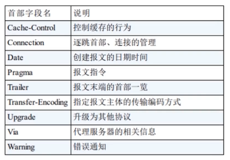
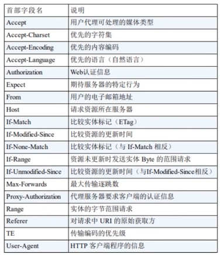
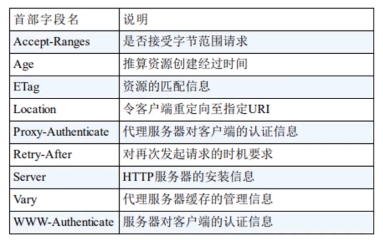
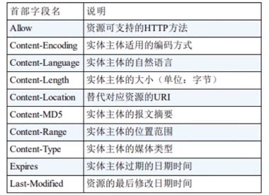
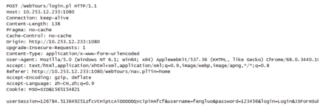
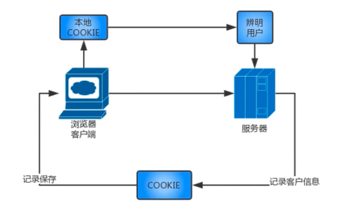
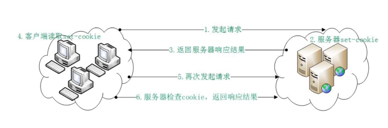

# HTTP 协议结构和通讯原理

## 协议特点

- 支持客户/服务器模式
  - 客户/服务器模式工作的方式是由客户端向服务器发出请求， 服务器响应请求，并进行相应服务。

- 简单快速
  - 客户向服务器请求服务时，只需传送请求方法和路径
  - 请求方法常用的有 GET、POST、HEAD，每种方法规定了客户和服务器联系的类型不同
  - 由于 HTTP 协议简单，使得 HTTP 服务器的程序规模小，因而同心速度很快
- 灵活
  - HTTP 允许传输任意类型的数据对象
  - 正在传输的类型由 Content-type（Content-type是HTTP包中用来表示内容类型的标识）加以标记
- 无连接
  - 无连接的含义是限制每次连接只处理一个请求
  - 服务器处理完客户端的请求，病收到客户的应答后，即断开连接
  - 采用这种方式可以节省传输时间
- 无状态
  - HTTP 协议是无状态协议
  - 无状态是协议对于事务处理没有记忆能力，缺少状态意味着如果后续处理需要前面的信息，则需要重新传输，这样可能会导致每次连续传送的数据量增大
  - 另一方面，在服务器不需要先前信息时它的应答就较快

## URI 和 URL

> 我们在浏览器里的Web地址应该叫 URL 还是 URI ？

URI 是一个紧凑的字符串用来标示抽象或物理资源，一个 URI 可以进一步被分解为定位符、名字或者两者都是，而我们常说的 URL（Uniform Resource Locator）其实是 URI 的子集，除了确定一个资源，还提供一种定位该资源的主要访问机制（比如网络“位置”）。

URI 可以被分为 URL ，URN 或同时具备 locators 和 names 特性的一个东西，URN 的作用就好像一个人的名字，URL 就像是一个人的地址，通俗地讲，就是 URN 确定了东西的身份，而 URL 提供了找到它的方式。

所谓的 URL 是 URI 的一种，但不是所有的 URI 都是 URL，URI 和 URL 最大的差别就是“访问机制”，URN 则是唯一标识的一部分，是身份信息。

> 思考：以下哪些是 URI，哪些是 URL，哪些是 URN ？

① ftp://ftp.is.co.za/rfc/rfc1808.txt<br>
②  http://www.ietf.org/rfc/rfc2309.txt<br>
③ ldap://[2001:db8::7]/c=GB?objectClass?one<br>
④ mailto:John.Doe@example.com<br>
⑤ news:comp.infosystems.www.servers.unix<br>
⑥ tel:+1-816-555-1212<br>
⑦ telnet://192.0.21.16:80/<br>
⑧ urn:oasis:names:specification:docbook:dtd:xml:4.1.2

以上全部都是 URI，而提供了访问机制的① ② ③ ④ ⑤ ⑦则是 URL， ⑧则是 URN。

回到最开始的问题，浏览器中输入的是 URI 还是 URL，这里说是 URI 可能会更准确，更专业，因为经常使用的 URI 不是严格技术意义上的 URL，比如说你所需要的文件在 google.com，这是 URI 而不是 URL，系统可能会对很多协议和端口做出正确的访问，比如说当对(https://www.google.com)或者(ftp://www.google.com)进行访问时，可能会得到不同的访问结果，所以从这个技术角度出发，我们称之为 URI，但为了通俗易懂，URL可能会被大众所熟记。

## HTTP 报文结构分析

## 请求报文

下图是一个完整的请求报文：


从中我们可以看出请求报文的重要组成部分，可大体分为三类，请求行、请求报文头、请求报文体，而其中的**报文头大体可以分为四类**，在 HTTP/1.1中，统共规范了标准化的**47**种报文头字段。

- 通用报文头
  - 
  - 可以用在请求报文也可以用在响应报文
  - Connection
    - keep-alive 当一个网页打开完成之后，客户端和服务器之间用于传输 HTTP 数据的 TCP 链接不会关闭，如果客户端再次访问这个服务器上的网页，会继续使用这一条已经建立的连接
    - close 表示一个 Request 完成后，客户端和服务器之间用于传输 HTTP 数据的 TCP 连接会关闭，当客户端再次发哦是发送请求时，需要重新建立 TCP 连接
  - Referer 这个字段是当浏览器发送请求时，一般都会带上，告诉服务器请求是从哪个页面连接过来的，服务器籍此可以获得一些信息用于处理
  - User-Agent 很多情况下会根据此字段判断浏览器类型，做不同的兼容性设计
- 请求报文头
  - 
  - 专用在请求报文
  - Accept 如果想要给现实的媒体类型增加优先级，则用 q= 来额外的表示权重（q 的范围是0~1，可精确到小数点后三位），1 最大，不指定时默认为 q=1.0
  - Accept-Language:zh-cn,zh;q=0.7,en-us,en;q=0.3 表示客户端在服务器有中文资源的情况下，会请求其返回中文版对应的响应，没有时则响应英文版
- 响应报文头
  - 
  - 专用在响应报文
- 实体报文头
  - 

## 响应报文

下图是一个完整的响应报文：


从中我们可以看出响应报文的重要组成部分，可大体分为三类，响应行、响应头、响应体：

- 响应行：涉及报文协议及版本、状态码及状态描述
- 响应头：响应头也是报文头，和之前提及的请求报文头比较类似，一般包含服务器类型，响应数据类型、产生时间等等
- 响应体：响应报文的主体，会对返回的内容进行解析，最终处理到系统中去。

## 请求方法剖析

以下是在 HTTP/1.1 常用请求方法：

- GET
- POST
- PUT
- HEAD
- DELETE
- OPTIONS
- TRACE
- CONNECT

### GET

GET 方法用来请求访问已被 URI 识别的资源，会将指定的资源经服务端解析后返回响应的内容，是默认的 HTTP 的请求方法，比如说当在浏览器中直接输入请求的 URI 时，浏览器采用的就是 GET 方法。

一般我们通过 GET 传递数据时，会用过？以及 & 的方式对参数进行拼接然后缀在 URL 的后面，此时参数会作为 URL 的一部分向服务端进行请求发送。

当参数作为 URL 的一部分参与请求时，提交的数据量不能过大，这是因为浏览器对于 URL 的长度有一定的限制，IE 的限制长度为 2803，Firefox 的限制长度为 Chrome 的限制长度为 8182，Safari 的限制长度为 80000。

GET 可以迎来提交表单和其他数据：

```js
http://localhost/login?username=zhangsan&password=123456
```

从上面的 URL 请求中我们可以非常容易的辨认出表单提交的内容，因此 GET 提交数据时一般会有一定的安全隐患，再者就是由于浏览器的长度限制。

### POST

POST 方法其实是后续对 GET 方法的一种替代方法，两者功能类似，不过 POST 的主要目的不是获取响应主体的内容，一般用来传输实体的主体，做提交请求。



通过 POST 提交数据时，请求报文会发生变化，会在请求报文头下**空行**，然后下面就是要提交的表单数据。POST 方法克服了 GET 请求的一部分缺点，数据不会作为 URL 请求的一部分，而是作为标准数据传输给服务器，这就避免了 GET 请求中数据无法保密和数据量小的问题。

:::tip
公共电脑下会通过查看浏览器记录而得到 GET 请求的一些信息，而 POST 就不会
:::

### PUT

PUT 方法从客户端向服务器传送的数据取代指定的文档的内容，PUT 方法和 POST 方法在使用上是基本相同的，都是用来提交参数的最大的不同点就是 PUT 是幂等的，而 POST 是不幂等的，因此更多时候使用 PUT 方法用作传输资源。

HTTP/1.1 中的 PUT 方法不带有验证机制，其存在一定的安全性问题，所以一般的 Web 网站应用不太常用 PUT 方法。

### HEAD

HEAD 方法类似于 GET 请求，只不过 HEAD 方法只是请求消息的报文头而不是完整的内容，返回的响应中没有具体的内容，用于获取报文头。

对于 HEAD 方法的回应部分来说，它的 HTTP 头部信息中包含的信息和 GET 请求得到的信息是相同的，所以利用这个方法就可以不必传输整个的资源内容，就可以得到想要请求的 Request URI 所标识的资源信息。

通常用 HEAD 测试超链接资源的有效性。

### DELETE

DELETE 方法是跟 PUT 方法相反的方法，用来请求服务器删除指定的资源。

HTTP/1.1 中的 DELETE 方法不带有验证机制，其存在一定的安全性问题，所以一般的 Web 网站应用不太常用 DELETE 方法。

### OPTIONS

OPTIONS 方法用来查询针对请求 URI 指定的资源支持的方法，当我们不知道对方服务端支持什么请求方式时，进行一个询问。

### TRACE

TRACE 方法主要用于回显服务器收到的请求，主要用于测试和诊断。客户端可以通过 TRACE 方法查询发送出去的请求是如何被加工需改过，或者说是被篡改，当一个请求想要连接原目标服务器时，可能会通过代理中转，TRACE 方法就是用来确认连接过程中发生的一系列操作，看看中转的过程。

由于 TRACE 不常用，而且容易引发 XST（跨站追踪）攻击，所以一般不用。

### CONNECT

CONNECT 方法会开启一个客户端和所请求资源之间的双相沟通的通道，可以用来创建隧道。

Web 网页开发时基本不会用到，一般在使用代理服务器访问互联网的时候，会使用 CONNECT 方法。比如，通过一个 HTTP 代理访问谷歌，首先浏览器会向代理服务器发送一个 CONNECT 请求，代理服务器返回 HTTP 200 这个状态码，表示请求成功，连接建立，之后浏览器就会和服务器进行握手并交换数据，代理服务器只负责传输彼此的数据包，并不能读取具体的数据内容。

## 状态码

状态码是用来表示网页服务器超文本传输协议响应状态的3位数字代码。


### 状态码详解


### 常用状态码

| 状态码        |  状态码英文名称    |  描述  |
| ----------   | ------------:   | :----: |
| 200          | OK              |   请求已成功，请求所希望的响应头或数据体将随此响应返回  |
| 202          | Accepted        |  已接受，已经接受请求，但未完成处理    |
| 206       | Partial Content      |   部分内容，服务器成功处理了部分 GET 请求    |
| 301       | Moved Permanently     |   永久移动，请求的资源一杯永久的移动到新 URI，返回信息会包括新的 URI，浏览器会自动定向到新的 URI。今后任何新的请求都应使用新的 URI 代替    |
| 302       | Found |   临时移动，与301类似。但资源只是临时被移动，客户端应继续使用原有的 URI    |
| 400       | Bad Request |  客户端请求的语法错误，服务器无法理解    |
| 401       | Unauthorized |  请求要求用户的身份认证    |
| 403      | Forbidden |  服务器理解请求客户端的请求，但拒绝执行此请求    |
| 404       | Not Found |  服务器无法根据客户端的请求找到资源（网页）    |
| 500      | Internal Server Error |  服务器内部错误，无法完成请求    |
| 502      | Bad Gateway |  充当网关或代理的服务器，从远端服务器接收到一个无效的请求   |

## HTTP 状态管理：Cookie 与 Session

### Cookie

::: tip
Cookie 实际上是一小段的文本信息
:::

当客户端请求服务器，如果服务器需要记录该用户的状态，就像客户端浏览器发送一个 Cookie。客户端浏览器就会把 Cookie 保存起来，当浏览器再次请求该网站时，浏览器把请求的网址连同该 Cookie 一同提交给服务器，服务器检查该 Cookie ，以此来辨认用户状态。



#### Cookie 工作原理



### Session

::: tip
Session 是另一种记录客户状态的机制，保存在服务器上
:::

客户端浏览器访问服务器的时候，服务器把客户端的信息以某种形式记录在服务器上。客户端浏览器再次访问时只需要从该 Session 中查找该客户的状态就可以了。

#### Session 工作原理


#### Session ID 的存储

- Cookie
  - 通过 Cookie 存储 Session ID 是最常见的存储方式
  - 由于可以人为的将客户端浏览器的 Cookie 禁用掉，所以不是唯一的存储方式
- URL 重写
  - 把 Session ID 直接附加在 URL 路径后面，作为附加信息进行传递
    - http://.../xxx;Sessionid=xxxxxxxxxxxxxxx
  - 把 Session ID 直接附加在 URL 路径后面，作为查询参数
    - http://.../xxx?Sessionid=xxxxxxxxxxxxxxx
- 隐藏表单
  - 服务器会自动修改表单，添加一个隐藏的字段，以便表单提交的时候能够把 Session ID 传递到服务端

#### Session 的有效期

- Session 超时失效
  - Session 和 Cookie 其实都可以设置有效时间，但 Cookie 的有效时间一般会比较久，而 Session 需要考虑越来越多的用户访问服务器，造成 Session 会越来越多，为了防止内存溢出，因此服务器会将长时间不使用的 Session 清除掉，这个时间就是 Session 的超时时间，如果超过超时时间没访问服务器，Session 就会自动失效
- 程序调用 HttpSession.invalidate()
  - 当用户进行退出、注销等操作时，可以调用服务器该方法主动清除掉 Session
- 服务器进程被停止
  - 服务器一般会把缓存放在内存里，当服务器异常终止时，一般情况下也会将 Session 清除掉

### Cookie 与 Session 的不同

- 存放位置不同
  - Cookie 存储在客户端
  - Session 存储在服务端
- 安全性（隐私策略）的不同
  - Cookie：由于其存放在浏览器，是可见的，因此可能会被客户端进行窥探、复制甚至篡改 Cookie 里面的内容，建议加密传输通过服务端解密
  - Session：由于其存放在服务端，对客户端来说是透明的，不存在敏感信息泄露的风险
- 有效期上的不同
- 对服务器的压力不同
