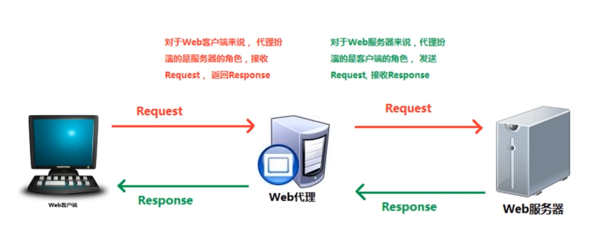
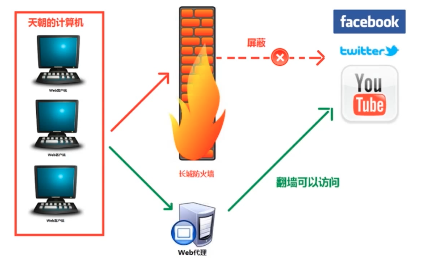
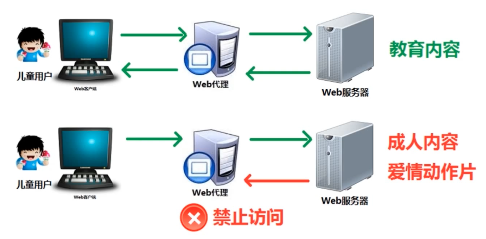
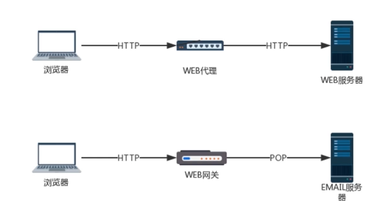
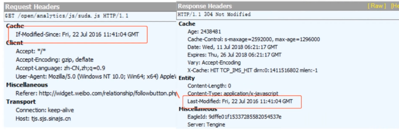
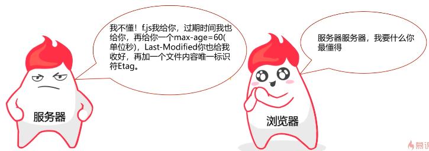
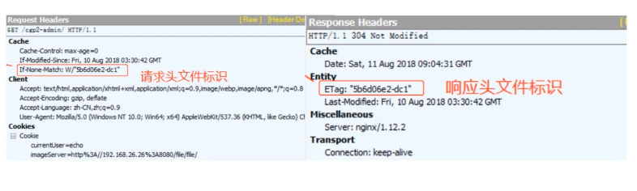
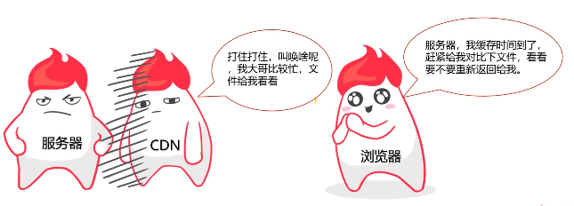

# HTTP 的特性和使用

## HTTP 协议编码解码

### 编码规范

一套完整的编码规范，其中包含**字库表、字符集和编码方式**。

一套编码规范不一定包含所有的字符，每套编码规范都有自己的使用场景，而字库表就存储了编码规范中能显示的所有字符，计算机会根据二进制数从字库表中找到对应的字符，进而进行现实操作。例如，所有的汉字基本都保存在 GBK 编码规范的字库表中，所以可以显示写汉字，其他语言不在 GBK 中，因此无法显示。

在一个字库表中每个字符都有一个对应的二进制地址，字符集则是这些地址的集合，例如：在 ASCII 码的编码字符集里，a 字母的序号的地址是65，转化为二进制就是 010001。可以说，编码字符集就是用来存储这些二进制数的，而这些二进制数就是编码字符集中的一个元素，同时，它也是字库表中字母 a 的地址，通常，根据相应的地址就可以显示出对应的文字。

字库表和字符集是一一对应且可以相互转换的，这是电脑识别字符的关键。

虽然我们可以根据二进制的地址得到相对应的字符，但直接使用字符的二进制地址来显示文字，因为二进制很长，因此这是十分麻烦且浪费的。因此制定了算法对字符集进行编码，而每种不同的算法我们都称之为一种编码方式。

一套编码规范可以有多种不同的编码方式，不同的编码方式有不同的适应场景，比如：utf-8是编码方式，而它对应的编码规范叫做 Unicode，而除了utf-8之外，还有utf-16，utf-32等编码方式，每种编码方式节约的空间也是不同的。

一个较短的二进制数通过一种编码方式转化成编码字符集中对应的地址，然后在字库表里找到一个对应的字符，最终显示给用户，这就是计算机显示文字的过程。

----------

### 常见的编码规范介绍

- ASCII码：ASCII码是最早产生的规范，只需要一个字节的存储，总共包含了00000000到01111111，共128个字符，可以表示阿拉伯数字、大小写英文字母以及一些简单的符号。它没有特定的编码方式，直接使用地址对应的二进制数来表示，但是一般还是称之为 ASCII码 编码方式。
- GBK：全称是汉字内码扩展规范，GBK 字符集所有的字符都占两个字节，没有特定的编码方式。
- ISO-8859-1：收录的字符除 ASCII 收录的字符外，还包括了西欧语言、希腊语、泰语、阿拉伯语、希伯来语等对应的文字符号，这种编码范围使用了单字节内的所有空间。把其他任何编码的字节流当作ISO-8859-1编码看待都没有问题。例如：MySQL数据库默认编码是Latin1就是利用了这个特性。ASCII编码是一个7位的容器，ISO-8859-1编码是一个8位的容器。不兼容中文。
- Unicode：Unicode（统一码、万国码、单一码）是一种在计算机上使用的字符编码。它为每种语言中的每个字符设定了统一并且唯一的二进制编码，以满足跨语言、跨平台进行文本转换、处理的要求。

----------

### 问题

> 为什么会产生乱码？

在计算机解码和编码的过程中都有可能导致乱码的产生。

- 解码过程：一串二进制数字使用一种编码方式转换成字符，我们称之为解码，在解码过程中，我们可以选择不同的编码方式进行字符解码，但往往只有一种编码方式可以进行正确的字符解码，显示出正确的文字，因此当选用了错误的编码方式进行解码，就会导致乱码的产生。

- 编码过程：一串已经解码的字符使用一种编码方式转换成一串二进制数字，我们称之为编码或者加密过程。无论使用何种编码方式进行编码，都会生成计算机可识别的二进制数，但如果编码规范的字库表里不包含目标字符，那就无法在字符集中找到对应的二进制数，就会导致不可逆的乱码。

乱码其实就是编码和解码使用的编码方式不一致或者编码的时候它的字库表里不包含相应字符导致的结果。

> HTTP 如何处理编码与解码

第一、由于 URL 是采用 ASCII 字符集进行编码的，所以如果 URL 中包含有非 ASCII 字符集中的字符，需要对其进行编码。

第二、由于 URL 中含有一些保留字，其含有特殊意义，因此先要在 URL 中使用这些保留字，就需要进行编码。如："&" 表示参数分隔符，"?" 表示连接作用或清除缓存等。

第三、根据 HTTP 的 RFC "%编码"规范，对于 URL 中属于 ASCII 字符集的非保留字不做编码。对 URL 中的保留字需要取其 ASCII 内码，然后加上 “%” 前缀将该字符进行编码；对于 URL 中的非 ASCII 字符集需要取其 Unicode 内码，然后加上 “%” 前缀将该字符进行编码。

## HTTP 协议-身份认证

身份认证信息包含密码、动态令牌、数字证书、生物认证、IC 卡等。我们可以通过以上信息来识别一个人所具备的个人信息。

在 HTTP 协议中，有几种常用的认证方式：

- BASIC 认证（基本认证）
- DIGEST（摘要认证）
- SSL 客户端认证
- FormBase认证（基于表单认证）

### BASIC 认证

从 HTTP/1.0 就定义的一种认证方式，到目前为止，仍有一部分网站使用这种认证方式。如下图，它是 Web 服务器和通信客户端之间进行的一种统一的认证方式。

下图是 BASIC 认证的过程：

步骤1：当请求的资源需要 BASIC 认证时，服务器会随状态码 401 Authorization Required，返回 WWW-Authenticate 首部字段（响应头）的响应。该字段内包含认证的方式（BASIC）及Request-URI 安全域字符串（realm）。

步骤2：接收到状态码 401 的客户端为了通过 BASIC 认证，需要将用户ID及密码发送给服务器。发送的字符串内容是由用户名 ID 和密码构成，两者中间以冒号（:）连接后，再经过 Base64 编码处理。

假设用户 ID 为 guest，密码是 guest 连接起来形成"guest:guest" 这样的字符串。然后**经过 Base64 编码**成 Z3Vlc3Q6Z3Vlc3Q=。把这个字符串前面拼接 Basic 形成 "Basic Z3Vlc3Q6Z3Vlc3Q="（**此处 Basic 与经过 Base64 编码的数据中间有一个空格**），然后把这个字符串写入首部字段 Authorization 后，发送请求。

当用户端为浏览器时，一个仅需要输入用户 ID 和密码即可，浏览器会自动完成 Base64 编码的工作，并再前面添加 "Basic" 前缀。

步骤3：接收到包含首部字段 Authorization 请求的服务器，会对认证信息的正确性进行验证。如果验证通过，则返回一条包含 Request-URI 资源的响应。

#### BASIC 认证的的缺点

- BASIC 认证虽然采用 Base64 密码方式，但这不是加密处理。不需要任何附加信息即可对其进行解码。换言之，由于明文解码后就是用户名 ID 和密码，在 HTTP 等非加密通信线路上进行 BASIC 认证的过程中，如果被人窃听，被盗的可能性极高。所以，BASIC 认证需要配合HTTPS来保证信息传输的安全。
- 即使密码被强加密，第三方仍可通过加密后的用户名和密码进行重放攻击
- 如果想再进行一次 BASIC 认证时，一般的浏览器却无法实现认证注销操作。所以，BASIC 认证使用上不够灵活，且达不到多数 Web 网站期望的安全性等级，因此并不常用。

### DIGEST 认证

为了弥补 BASIC 的缺点，因此从 HTTP/1.1 开始，就有了 DIGEST 认证。虽然 DIGEST 认证也采用了质询 / 响应的方式，但并不会和 BASIC 认证一样直接发送明文密码。

下图是 DIGEST 认证的过程：

- 步骤 1： 请求需认证的资源时，服务器会随着状态码 401Authorization Required，返回带WWW-Authenticate 首部字段的响应。该字段内包含质问响应方式认证所需的临时质询码（随机数:nonce）。首部字段 WWW-Authenticate 内必须包含realm 和nonce 这两个字段的信息。客户端就是依靠向服务器回送这两个值进行认证的。nonce 是一种每次随返回的 401 响应生成的任意随机字符串。该字符串通常推荐由Base64 编码的十六进制数的组成形式，但实际内容依赖服务器的具体实现。

- 步骤 2：
  - 接收到401状态码的客户端，返回的响应中包含 DIGEST 认证必须的首部字段 Authorization 信息。首部字段 Authorization 内必须包含 username、realm、nonce、uri 和response的字段信息。其中，realm 和 nonce 就是之前从服务器接收到的响应中的字段。

  - username是realm 限定范围内可进行认证的用户名。uri（digest-uri）即Request-URI的值，但考虑到经代理转发后Request-URI的值可能被修改因此事先会复制一份副本保存在 uri内。

  - response 也可叫做 Request-Digest，存放经过 MD5 运算后的密码字符串，形成响应码。

- 步骤 3：接收到包含首部字段 Authorization 请求的服务器，会确认认证信息的正确性。认证通过后则返回包含 Request-URI 资源的响应。并且这时会在首部字段 Authentication-Info 写入一些认证成功的相关信息。

DIGEST 认证提供了高于 BASIC 认证安全等级，但和 HTTPS 客户端认证相比，还是比较弱等级的认证。DIGEST 提供了防止密码被窃听的保护机制，但并不防止用户伪装的这种保护机制，所以 DIGEST 和 BASIC 认证一样，使用起来不那么的简洁灵活，并且达不到大多数网站对于 Web 安全要求高度安全等级的标准，所以其适用范围也很有限。

### SSL 客户端认证

SSL 客户端认证是借由 HTTPS 的客户端证书完成认证的方式。凭借客户端证书认证，服务器可确认访问是否来自于已登录的客户端。

下图是 SSL 客户端认证的过程：

- 步骤 1：客户机发送安全会话请求，服务器接收到需要认证资源的请求，会发送 Certificate Request 报文，要求客户端提供客户端证书。

- 步骤 2：用户选择将发送的客户端证书后，客户端会把客户端证书信 息以 Client Certificate 报文方式发送给服务器。

- 步骤 3：服务器验证客户端证书验证通过后方可领取证书内客户端的公开密钥，然后开始 HTTPS 加密通信。

### FormBase 认证

由于出于对安全性以及使用便利性的考虑，HTTP 协议标准提供的 BASIC 认证和 DIGEST 认证几乎不怎么使用。另外， SSL 客户端认证虽然有跟高的安全等级，但由于导入以及维护费用等问题，目前还暂未普及使用。

事实上，基于表单的认证方法并不是在 HTTP 协议中定义的，对于 Web 网站的认证功能，能够满足其安全使用级别的标准规范并不存在，所以只好使用由 Web 应用程序各自实现基于表单的认证方式。

那么为了让服务器知道“我是谁”，这里会通过 Cookie 和 Session 会话管理的方式来保持用户的状态。

## HTTP 协议-长连接与短连接

> HTTP 长短连接的本质？

HTTP 协议是基于请求/响应模式的，因此只要服务端给了响应，那么本次 HTTP 请求就结束了，由于 HTTP 协议属于应用层协议，而在传输层使用的是 TCP 协议，在网络层是 IP 协议，IP 协议主要解决的是网络路由、寻址等问题，而 TCP 主要解决的是如何在网络层（IP 层）之上可靠的传递数据包，使在网络的另一端收到发端发送的所有包并且顺序和发出顺序一致。

HTTP 的长连接和短连接其本质上其实是 TCP 长连接和短连接。由于 TCP 连接是一个双向通道，可以在一段时间内保持不关闭，因此 TCP 才有长连接和短连接这样的说法。实际上，HTTP 请求和 HTTP 响应都是通过 TCP 连接这个通道来回传输的。

**在 HTTP/1.0 中，默认使用的就是短连接**，每当浏览器和服务器进行一次 HTTP 操作，就会建立一次连接，任务结束时，就会中断当前连接。

而**在 HTTP/1.1 起，默认使用长连接**，用以保持连接特性。在长连接情况下，多个 HTTP 请求可以复用同一个 TCP 连接，这就节省了很多 TCP 连接建立和断开的消耗。

其次，长连接并不是永久连接的。如果一段时间内（具体的时间长短，是可以在 header 当中进行设置的，也就是所谓的超时时间），这个连接没有 HTTP 请求发出的话，那么这个长连接就会被断掉。否则的话，TCP 连接将会越来越多，直到把服务器的 TCP 连接数量撑爆到上限为止。

## HTTP 中介-代理

代理是一种有转发功能的应用程序，它扮演了位于服务器和客户 端“中间人”的角色，接收由客户端发送的请求并转发给服务器，同时 也接收服务器返回的响应并转发给客户端

### 代理的作用

- 抓包：为了能更好地分析 HTTP 请求，或者达到安全测试的目的，只有使用代理，才能更好可可以对来自于客户端的数据进行拦截，因此代理又被称之为拦截服务器
- 翻墙：（VPN 的实现是基于隧道协议实现的，跟此处的代理是完全不同的技术）

- 匿名访问：HTTP 协议本身具有匿名性质，指的是 HTTP 代理服务器通过删除 HTTP 请求报文中的身份特性（如：客户端的 ip 地址，Cookie，会话 ID 等），从而对远端的服务器隐藏原始用户的 ip 地址以及一些其他的细节，同时 HTTP 代理服务器也不会记录原始用户访问记录的日志。
- 过滤器：由于 HTTP 并不知道访问网络的是谁，即便是小朋友使用父母的账号进行访问，认证结果也会将次当做原用户。HTTP 的识别能力依赖于其认证机制，因此只要通过了认证，HTTP 协议也会认为是认证者本人在进行使用。

   因此通过代理服务器分析、对部分请求进行拦截更进一步加强对网络的控制。

## HTTP 中介-网管

网关可以作为某种翻译器使用，它抽象出了一种能够到达资源的方法。通俗的来讲，网关是资源和应用程序之间的粘合剂。

如上图所示，代理连接的是两个或者多个使用相同协议的应用程序，而网关连接的是两个或者多个不同协议的端点。所以网关扮演的是“协议转换器”的角色。

网关可以分为两种，一种是从客户端的角度做协议转换出，另一种则是从服务端的角度做协议转换入。Web 网关在一侧使用 HTTP 协议，在另一侧使用另一种协议，

- （HTTP/）服务端网关：通过 HTTP 协议与客户端对话，通过其他协议与服务器通信
  - （HTTP/*）服务器端 Web 网关，如：发邮件
  - （HTTP/HTTPS）服务器端安全网关
- （/HTTP）客户端网关：通过其他协议与客户端对话，通过 HTTP 协议与服务器通信
  - 资源网关
  - （HTTPS/HTTP）客户端安全加速器网关

## HTTP 缓存

> HTTP 缓存的意义是什么，它缓存了哪些内容？

缓存是指代理服务器或客户端本地磁盘内保存的资源副本。HTTP 缓存主要针对样式文件，脚本文件，图片文件这样一系列更新频率不太频繁的静态文件资源。利用缓存可减少对源服务器的访问，因此也就节省了通信流量和通信时间。

> 缓存是通过什么实现的？

在 HTTP 协议中，更多的是通过请求头和响应头来实现的。

- Cache-Control：**请求/响应头**，缓存控制字段

- Expires：**响应头**，表示资源过期时间，由服务器返回提供，是 http1.0的属性，在与 max-age 共存的情况下，其优先级要低。
- Last-Modified：**响应头**，资源最新修改时间，由服务器告诉浏览器
- if-Modified-Since：**请求头**，资源最新修改时间，由浏览器告诉服务器，和 Last-Modified 是一对，他两会进行比对
- Etag：**响应头**，资源标识，由服务器告诉浏览器
- if-None-Match：**请求头**，缓存资源标识，由浏览器告诉服务器（其实就是上次服务器给的 Etag），和 Etag 是一对，它两会进行比对

### HTTP 缓存工作方式

> 场景一：让服务器与浏览器约定一个文件过期时间 ----- Expires

上述场景下，虽然我们可以对服务器返回的 Expires 这个过期时间进行比对处理，通过比对结果来选择时候要重新进行资源请求。但是会存在一个问题，假设通过比对 Expires 过期时间，我们需要重新进行资源请求，但此时服务器对应的资源文件并未发生改变，那么这次请求我们要如何去避免请求呢？于是引入了场景二。

> 场景二：让服务器与浏览器在约定文件过期时间的基础上，再加上一个文件最新修改时间的对比---- Last-Modified 与 if-Modified-Since

- Expires 未过期，不发送更新资源请求
- Expires 过期，客户端请求时会在请求头中加上 if-Modified-Since （即上次请求服务器返回的 Last-Modified），服务器接收到请求会用接收到的 if-Modified-Since 和服务器的文件最新修改时间作对比，如果不对等，服务器则会查找最新的资源文件，并返回给客户端+Expire+Last-Modified，反之则会返回 304，告知客户端文件未更改，客户端可使用之前的缓存。

但是上述的场景也并非万无一失，由于客户端可对 Expires 过期时间做修改，或者由于 if-Modified-Since 这个时间只能精确到秒，如果文件就是在1秒内发生更改，客户端也是拿不到更新过后的资源。因此引入了场景三。

> 场景三：让服务器与浏览器在过期时间 Expires+Last-Modified 的基础上，增加一个文件内容的唯一对比标记------ Etag 与 if-None-Match。Expires 不稳定，则再加入一个 max-age来加以代替

max-age 代表在成功缓存后的60s内，不会再发起请求，会直接使用本地缓存，且它的优先级高于 Expires，则服务器返回 Expires 不会再使用。

60s之后，客户端会在请求头中带上 if-Modified-Since 和 if-None-Match（服务器上次返回的 Etag），发送请求后，服务器接收到请求会去对比接受的 if-None-Match 和服务器的文件内容唯一标识（由于 Etag 的优先级高于 Last-Modified，因此不会再比对 Last-Modified 和 if-Modified-Since），如果不对等，服务器则会查找最新的资源文件，并返回给客户端+Expire+Last-Modified（尽管这两个没什么用，但也会返回）+Etag+max-age，反之则会返回 304，告知客户端文件未更改，客户端可使用之前的缓存。

虽然上述三种场景层层增强，我们已经可以对比服务器文件和客户端缓存文件的差异，但是其实还存在一定的缺陷，比如当 Expires 或者 max-age 不过期时，服务器文件发生变化时，客户端是无法感知到的。如何解决这类问题呢？

### 缓存改进方案

- md5/hash 缓存：通过不缓存 html，为静态文件添加 MD5 或者 hash 标识，解决浏览器无法跳过缓存过期时间主动感知文件变化的问题
  - 假使浏览器第一访问时请求并缓存了文件名为 hash-1 的文件，当浏览器再次加载时，同样一个地方，文件指向了 hash-2，此时浏览器就不会使用本地缓存而是向服务器获取名为 hash-2 的文件，不会进行 HTTP 缓存文件对比

- CDN缓存：CND 是构建在网络之上的内容分发网络，依靠部署在各地的边缘服务器，通过中心平台的负载均衡、内容分发、调度等功能模块，使用户就近获取所需内容，降低网络用塞，提高用户访问响应速度和命中率
  - CDN 通过分流形式大大减轻了服务器端的压力
  - CDN 解决了跨地区访问的问题

### CDN 缓存工作方式

**第一次请求**

**后续请求**

* CDN 节点缓存的文件并没有过期，此时会向客户端返回 304
* CDN 节点缓存的文件过期，为了保险起见，会向服务器发送请求，成功拿到最新的文件并进行 CDN 缓存处理，然后再返回给客户端

其实 CDN 缓存和前面提到的 HTTP 缓存都有一个相同的问题，那就是 CDN 缓存时间不过期，浏览器始终被拦截，无法拿到最新的资源文件。缓存本身针对的是更新频率不高的静态资源文件，其次 CDN 缓存提供了分流以及访问加速等优势条件， CDN 缓存和 HTTP 缓存还有一个区别就是，它类似与一个平台，可以通过登录的形式提供了手动刷新 CDN 缓存的能力，也算是变相的解决了浏览器缓存无法手动控制的问题。

### 浏览器操作对 HTTP 缓存的影响

| 用户操作 | Expires/Cache-Control | Last-Modified/Etag |
| ---- |-----| ---|
| 地址栏回车 | 有效 | 有效 |
| 页面链接跳转 | 有效 | 有效 |
| 新开窗口 | 有效 | 有效 |
| 前进、后退 | 有效 | 有效 |
| F5刷新 | 无效 | 有效 |
| Ctrl+F5刷新 | 无效 | 无效 |

## HTTP 内容协商机制

内容协商机制其实指的是客户端和服务器就响应资源内容进行交涉，然后提供给客户端最为合适的资源。内容写上会以响应资源的语言、字符集、编码方式等作为判断的基准。

### 内容协商方式

| 驱动方式 | 概念 | 使用范围 | 优点 | 缺点 |
| ------ |-----| ------ | ------| ----- |
| 客户端驱动 | 客户端发起请求，服务器发送可选项列表，客户端做出选择后在发起第二次请求 | 几乎没有使用 | 实现起来比较容易，且尊重用户的真实意愿 | 首次访问什么都看不到，增加了时延，且至少要发送两次请求 |
| 服务器驱动 | 服务器检查客户端的请求头部集并决定提供哪个版本的页面 | 使用最广泛 | 比客户端驱动的协商快，只请求一次且 HTTP 提供了 q 权重机制，允许服务器进行近似匹配 |头部集都不符合时服务器要做猜测 |
| 透明协商 | 某个中间设备（通常是缓存代理）代表客户端进行协商 | 未来趋势，暂时使用较少 | 免除了 Web 服务器的协商开销，比客户端驱动要快 | 不是标准的 HTTP 方式，所以 HTTP 没有给其提供相应的规范 |

### 服务器驱动内容协商-请求首部集

| 发送告知类型 | 概念 | 概念 | 回复对应类型 |
| ------ |-----| ------ | ------ |
| Accept | 告知服务器发送何种媒体类型| 说明了实体主体内对象的媒体类型 | Content-Type|
| Accept-Language | 告知服务器发送何种语言| 告知客户端，实体主体使用的自然语言 | Content-Language |
| Accept-Charset | 告知服务器发送何种字符集| 说明了实体主体内对象的媒体类型 | Content-Type |
| Accept-Encoding | 告知服务器发送何种编码| 告知客户端服务器对实体的主体部分选 用的内容编码方式 | Content-Encoding |

### 近似匹配

>以 Accept-Language:en;q=0.5,fr;q=0.0,nl;q=1.0,tr;q=0.0 为例

用户最愿意接受 nl（荷兰语），没有的情况下可以接受 en（英语），不接受 tr（土耳其语）以及 fr（法语），在服务器都没有以上语言时，服务器会做猜测，所以服务器会在服务器端设置一个默认值，以防止这种情况的产生。

## HTTP 断点续传和多线程下载

断点续传是 HTTP 通过在 Header 里两个参数实现的，客户端发送请求时对应的是 Range，服务器端响应时对应的是 Content-Range。不管是断点续传还是多线程分块下载，如果续传成功，返回206，如果文件发生更新，则返回200以及新文件的内容，这属于 HTTP 协议中自带的规则。

- Range：用于请求头中，指定第一个字节的位置和最后一个字节的位置，一般的格式是：Range:(unit=first byte pos)-[last byte pos]
  - Range:bytes=0-499（从第0个到第499个完整的字节内容）
  - Range:bytes=500-999（从第550个到第999个完整的字节内容）
  - Range:bytes=-500（最后500个完整的字节内容）
  - Range:bytes=500-（第550个到文件结束的字节内容）
  - Range:bytes=500-600，600-999（即从第500个到第600的字节内容，也包含601-999的字节内容，分成两块下载）

- Content-Range：用于响应头中，在发出带Range的请求后，服务器会在Content-Range头部返回当前接受的范围和文件总大小。一般的格式是：Content-Range:bytes(unit first byte pos) - [last byte pos]/[entity length]
  - HTTP/1.1 200 OK（不使用断点续传方式）
  - HTTP/1.1 206 Partial Content（使用断点续传方式）

### 断点续传过程

1. 客户端下载一个1024k的文件，已经下载了512k
2. 网络中断，客户端请求续传，因此需要在 HTTP 头中申明本次需要续传的片段：Range:bytes=512000- 这个头通知服务器从文件的512k位置开始传输文件
3. 服务端在收到断点续传请求，从文件的512k位置开始传输，并且在 HTTP 头部增加：Content-Range:bytes 512000-1024000 并且此时服务器返回的 HTTP 状态码应该是 206 而不是200

因此可以考虑到，多线程下载的流程和断点续传的过程是类似的，只不过断点续传是被动的增量下载，而多线程下载是主动的分片下载，但同样适用的都是 Range 这样的模式，例如将100M的文件分成100片，第一片请求是 Range:0-1024000，第二片请求时Range:1024001-2048000... 以此类推，这样的模式不断叠加主动地分成100片，每片是源文件的1/100。
