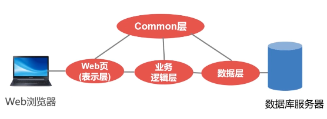
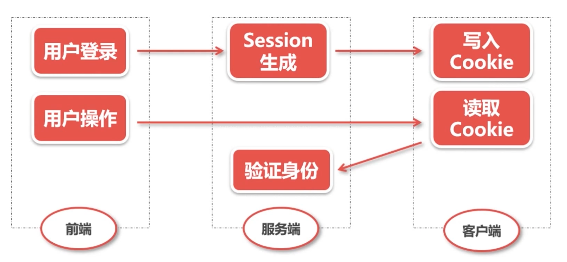

# Web 安全威胁解析

## Web 安全攻击概述

#### Web 应用的概念

Web 应用是由动态脚本、编译过的代码等组合而成的，它通常都是架设在 Web 服务器上，用户在 Web 浏览器上发送请求，这些请求使用 HTTP 协议，由 Web 应用和后台服务的数据库及其他动态内容通信。

典型的Web应用是三层架构模型：Web层（View）、业务逻辑层（Controller、Service）、数据层（Model）。而发生 Web 安全问题一般出现在 Web 层和业务逻辑层的中间，因为 Web 层和业务逻辑层是发起请求的层。当 Web 安全出现了漏洞，就会在发起 HTTP 请求的过程中导致某些参数和内容发生错误，就会产生 Web 安全的问题。

#### 常见的一些安全隐患

- 身份认证：攻击者通过错误使用程序的身份认证和会话管理功能，比如：攻击者伪造 Cookie 发送给服务器，从而绕过身份认证
- SQL 注入：攻击者将不受信任的数据作为命令或查询的一部分发送给服务器会产生 SQL 注入攻击，导致数据库的数据泄露了
- 安全配置错误：比如没有配置 HTTPS、或者 HTTPS 证书过期等等
- 跨站脚本攻击：XSS（跨站脚本）让攻击者能够在受害者的浏览器中执行脚本，并劫持用户会话或将用户重定向到恶意站点
- 使用了含有漏洞的第三方库
- 不足的日志记录和监控，使得服务器无法感知到攻击

## 验证机制安全

验证机制是 Web 应用程序中最简单的一种安全机制。一般来说，应用程序必须核实用户提交的用户名和密码是否正确，正确则允许其登录，否则禁止登录。

验证机制是整个 Web 应用中最外层的机制，是应用程序防御恶意攻击的核心机制，由于它处在安全防御的最前沿，如果其被轻易突破，通常应用程序的全部功能、数据都会被控制。

#### 典型的身份验证模式

#### 常见的验证技术

- 基于 HTML 表单的验证
- 多元机制，如组合型密码
- 客户端 ssl 证书

但在 Web 应用中使用对多的还是基于 HTML 表单的验证，但是这其中也存在着一些漏洞：

- 弱密码

    许多 Web 应用程序并没有或者很少对用户密码强度进行控制，比如非常短或者空白密码、以常用字典词汇位密码（123456）、密码会用户名完全相同、长时间使用默认密码等

- 暴力破解

    登录功能的公开性会诱使攻击者视图猜测用户名和密码，从而获得访问程序的权力。如果应用程序允许攻击者使用不同的密码暴力尝试，直到找到争取的密码，那这个程序就非常容易遭受攻击，一旦程序容易被暴力破解，那么安全性就大大降低。

    因此，为了防止应用程序被暴力破解，最常见的安全措施就是： 
    **验证码技术**，但是在使用时也需要注意几个问题： 
    1.验证码是否真实有效 
    2.验证码复杂度 
    **双因子认证**，核心是通过**个人密码+手机**来达到双重认证效果。 

- 忘记密码

    除了登录模块之外，还有另外一个模块---**忘记密码模块**，目前很多网站都提供了这个功能，而这个功能也存在着一些典型的安全问题。

    如果不考虑客服找回的情况，通常会有三种方式认证用户：用户设定的安全问题、在注册时留下的邮箱、给预留手机号发送验证短信。

## 会话管理机制

在绝大多数的 Web 应用程序中，会话管理机制是一个基本的安全组件，它和验证机制有类似的地方，但它又在验证机制之后， 它在应用程序执行登陆的过程中也是重要的一个环节，因为它可以在用户通过请求提交他们的证书后，持续向应用程序保证任何特定用户身份的真实性。

由于大部分的会话令牌是通过用户的用户名或者邮箱等信息进行编码或者模糊处理生成的，实际上是不太安全的，因此容易产生漏洞，比如令牌可被预测（包含隐含序列或者时间依赖的令牌）、令牌的随机数看似随机，其实其随机强度并不高， 从而被攻击。

会话在传输中也有漏洞，比如会话终止攻击，会话劫持攻击（通过网络嗅探、XSS攻击等方式获取用户会话令牌）。

> 如何进行防御？

1. 令牌传输安全
   - 令牌只能通过 HTTPS 传送
   - 如果适应 HTTP Cookie 传送令牌（大多数情况），应将这些 Cookie 标记为 **secure**，以防止用户浏览器通过 HTTP 传送它们。
2. 增加软硬会话过期
   - 软会话过期：用户在一定时间没有与应用系统交互，则会话过期，服务端清空 Session（Session失效）
   - 硬会话过期：用户登录到系统一段时间，不管用户做什么，该会话都会过期
3. 提供完善的注销功能
   - 用户可手动使会话过期（网站的退出功能）
   - TIPS：要保证注销不存在会话终止漏洞

## SQL 注入攻击

## 跨站脚本攻击

## CSRF 攻击