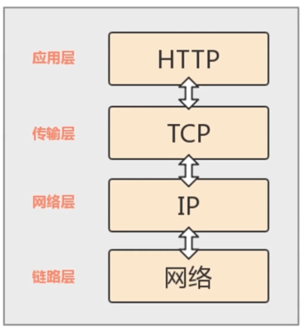
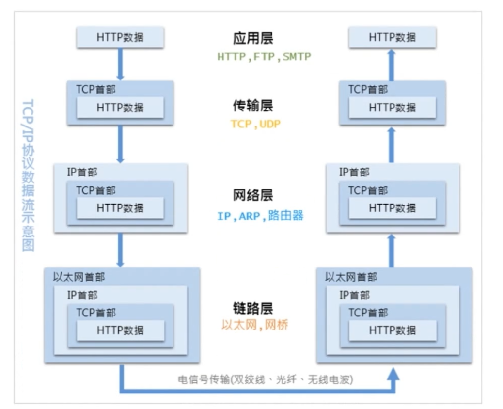
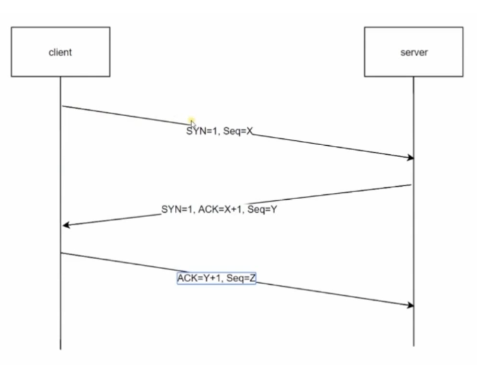
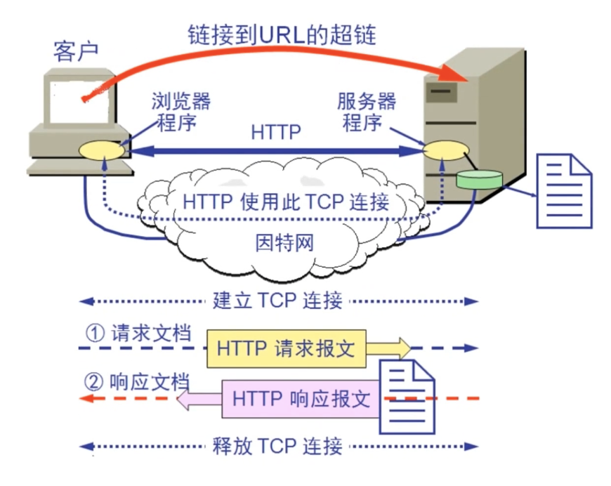

# 了解HTTP协议

## 浏览器背后的故事

:::tip
超文本传输协议(HTTP)是一种**通信协议**，它允许将超文本标记语言(HTML)文档从Web服务器传送到客户端的浏览器
:::

HTTP 我们可以简单的理解为用来在网页之间传递HTML的规则，HTTP 属于一个**应用层的面向对象的协议**，由于其简洁、快速的方式，适用于分布式超媒体信息系统，于1990年提出，经过几年的使用和发展，得到了不断地完成和扩展。

Web 和 HTTP 之间的联系，其实是 Web 是基于超文本和 HTTP 的全球性的、动态交互的、跨平台的分布式**图形信息系统**，是一种建立在 Internet 上的一种网络服务，为浏览器在 Internet 上查找和浏览信息提供了图形化的、可易于访问的直观界面，其中的文档及超链接将 Internet 上的信息节点组织成一个互为关联的网状结构。

要了解 HTTP 协议，我们需要了解用户在浏览器中输入网址并且按下回车之后发生了什么？[查看](https://github.com/skyline75489/what-happens-when-zh_CN)

## HTTP 的生平经历

## 透过 TCP/IP 看 HTTP

::: tip
HTTP 协议是构建在TCP/IP协议之上的，是TCP/IP协议的一个子集
:::

TCP/IP 协议其实是一系列与互联网关联的协议集合起来的总成，其中**分层管理**是 TCP/IP 协议的重要特征。

### TCP/IP 协议层

TCP/IP 协议族是由一个四层协议组成的系统，这四层分别为：应用层、传输层、网络层、数据链路层

- 应用层
  - 应用层一般是由我们编写的应用程序，决定了向用户提供的应用服务。应用层可以通过系统调用与传输层进行通讯。如：FTP、DNS、HTTP等
- 传输层
  - 传输层是通过系统调用想应用层提供处于网络连接中的两台计算机之间的数据传输功能
  - 在传输层有两个性质不同的协议：TCP（面向链接，效率低，可靠性高） 和 UDP（无连接，效率高，可靠性低）
- 网络层
  - 网络层用来处理在网络上流动的数据包，数据包是网络传输的最小数据单位。该层规定了通过怎样的路径（传输路线）到达对方计算机，并把数据包传输给对方
  - 在众多的传输路线中选择一条传输路线
- 链路层
  - 链路层用来处理连接网络的硬件部分。包括控制操作系统、硬件设备驱动、NIC（网络适配器）以及光纤等物理可见部分。硬件上的范畴均在链路层的作用范围之内。

### 数据封装的过程

### HTTP数据传输过程

如上图所示，发送端发送数据时，数据会从上层传输到下层，且每经过一层都会被打上该层的头部信息。而接受端接收到数据时，数据会从下层传输到上层，传输前会把下层的头部信息删除。

### 传输层-TCP三次握手

使用TCP协议进行通信的创房必须先建立连接，然后才能开始传输数据。为了确保连接双方的可靠性，在双方建立连接是时，TCP协议采取了三次握手策略。

--------

- 第一次握手
  - 第一次握手时客户端发送带有SYN标志的连接请求报文段，然后进入 SYN_SEND 状态，等待服务端的确认。
- 第二次握手
  - 第二次握手时服务端接收到客户端的 SYN 报文段后，需要发送 ACK 信息对这个报文进行确认，同时，还要发送自己的 SYN 请求信息。服务端会将上述的信息放到一个报文段（SYN + ACK 报文段）中，一并发送给客户端，此时服务端将会进入到 SYN_RECV 状态。
- 第三次握手
  - 第三次握手时客户端接收到服务端的 SYN + ACK 报文段后，会在生成一个 ACK ，并向服务端发送生成的 ACK 确认报文段，这个报文段发送完毕后，客户端和服务端都会进入到 ESTABLISHED 状态，完成 TCP 三次握手。

## DNS 域名解析

DNS 服务和 HTTP 协议有这密不可分的关系，当我们访问一个网站时，使用的是主机名或者域名来进行访问的。因为相对于 IP 地址（一组纯数字）来说，域名更会容易让人记住，但 TCP/IP 协议使用的是 IP 地址进行访问的，所以必须有个机制或者服务把域名转化成 IP 地址。DNS 服务就是用来解决这个问题的，**它提供了域名到 IP 地址之间的解析服务。**

为了提高效率，DNS 解析服务会采用就近原则，本地电脑会将经常访问的域名和响应的 IP 地址建立一个映射关系，并且保存在系统文件（host文件）里面 ，正常情况进行 DNS 解析的时候，系统会优先从本地的 host 文件中寻找对应的 IP 地址，如果找到了就直接使用其中的 IP 地址，如果没找到映射，接下来就会求助于本地的 DNS 服务，系统向本地的 DNS 服务发送请求去查询域名对应的 IP ，如果本地的 DNS 没有找到对应的 IP 地址，本地的 DNS 服务则会一层一层的向上一级 DNS 服务发送请求（DNS 的转发模式），直到 DNS 根服务器，如果找到了就进行回传，最终将找到的 IP 地址返回给浏览器。

## HTTP 事务处理过程

如上图所示，当我们的客户端在访问 Web 站点时，首先会通过 DNS 服务查询到域名的对应 IP 地址，然后浏览器生成 HTTP 请求，并通过 TCP/IP 协议发送给 Web 服务器， Web服务器接收到请求会根据请求生成响应内容，并通过 TCP/IP 协议返回给客户端。

> 以下是更为详细的事务处理流程：

访问一个页面时，我们会分解出 **协议名**、**主机名**、**端口**、**对象路径**等等一系列相关参数，接下来 DNS 服务会根据解析的相关参数解析相关的 IP 地址，下一步会封装 HTTP 请求所需要的数据包，然后再封装成 TCP 包，建立对应的 TCP 连接（三次握手），接下来会进行更高级的 HTTP 协议处理，进行 HTTP 协议请求，根据请求所发送的请求方法、参数，封装相关的 HTTP 请求报文，然后服务器进行相关的响应，响应之后，这个相应的消息体里面会有状态码、协议版本号、成功或失败的代码、服务器信息等等，最后最关键的一步就是当我们的 HTTP 响应完毕之后，我们需要对 TCP 连接进行一个释放。
