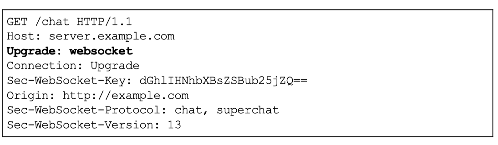
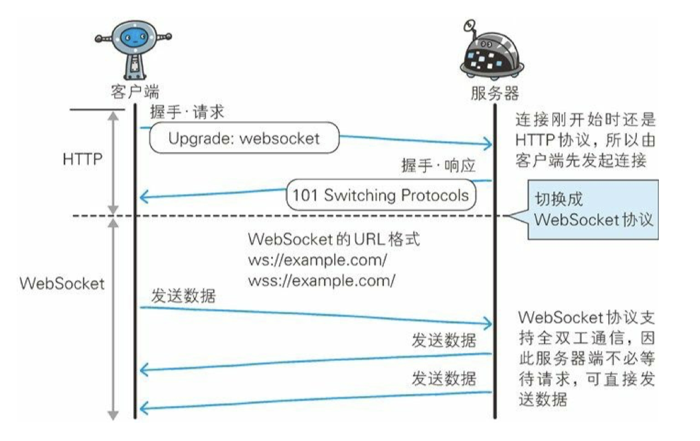
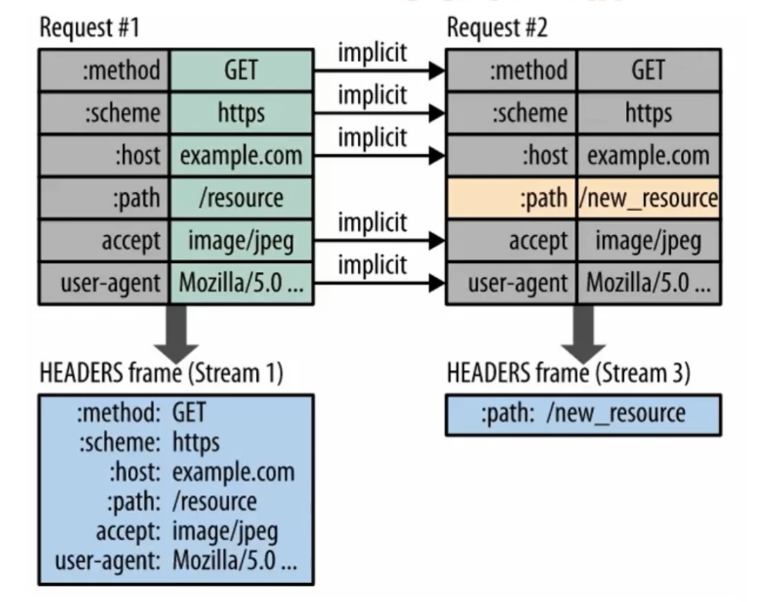
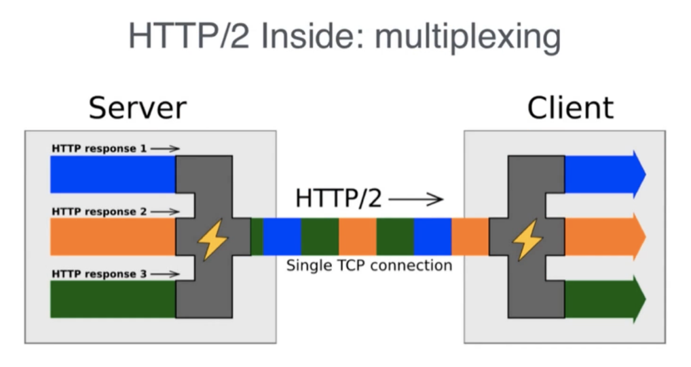
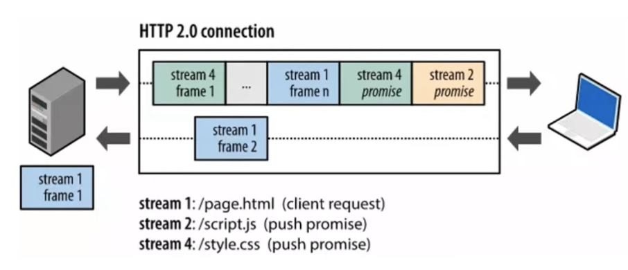
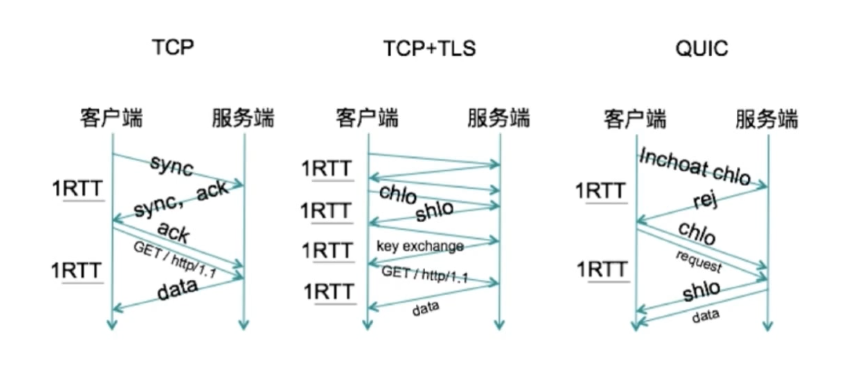
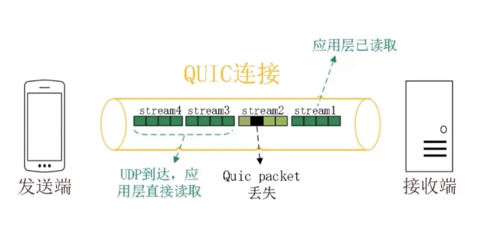
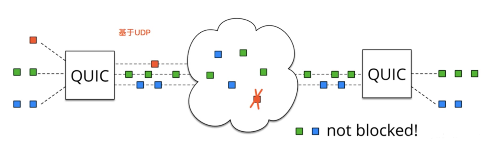

# 基于 HTTP 的功能追加协议

## HTTP 协议的瓶颈

虽然 HTTP 协议既简单又快捷，但随着时代发展，其现有的功能已不能满足日益增长的需求。

影响 HTTP 网络请求的因素主要有两个原因，一个是带宽，但由于现在网络基础建设的完备，带宽的影响目前已经微乎其微。另一个是延迟，延迟可以分为三个部分来说，一是浏览器的阻塞，二是 DNS 的查询，三是建立连接，由于连接无法复用，所以每次请求都要经历三次握手（在高延迟的场景下特别明显）和慢启动（对于文件类大请求有较大的影响）。

HTTP 协议存在一些瓶颈：

- 一条连接上只可以发送一个请求
- 请求只能从客户端开始，客户端不可以接受除响应之外的指令
- 请求/响应头部不经压缩就发送
- 每次互相发送相同的头部造成浪费较多
- 非强制压缩发送

## WebSocket 与 HTTP

### WebSocket 协议

WebSocket 其实是为了解决 HTTP 存在的一些瓶颈而做出的一种改良设计，WebSocket 是一种新的协议，跟我们原有的 HTTP 其实没有太大的关系，只是为了兼容现有的浏览器规范而已，它是对 HTTP 现有协议的一些补充。

WebSocket 与 HTTP 存在交集，但并不是说谁包含谁或者谁基于谁，而是两种独立的协议，为了能够更好支持和兼容现有的 HTTP 协议的握手规范，两者产生了一些交集。

> WebSocket 的握手请求



- 通过用到 HTTP 的 Upgrade 首部字段，告知服务器通信协议已更改为 WebSocket
- Sec-WebSocket-Key 字段内记录着握手过程中必不可少的键值（base64加密，浏览器随机生成）
- Sec-WebSocket-Protocol 字段内记录使用的子协议，用来区分同一个 URL 下不同的服务所需要的协议
- Sec-WebSocket-Version 字段内记录着当前的 WebSocket 协议的版本号

> WebSocket 的握手响应


- 对于之前的请求，返回状态码 101 Switching Protocols 的响应
- Sec-WebSocket-Accept 的值是有客户端传入的 Sec-WebSocket-Key 生成的
- Sec-WebSocket-Protocol 表示最终使用的协议

### 如何实现实时信息传递

其实在最开始的时候，想要实现实时信息传递的话，主要是通过 Ajax 轮询 或者 Long Poll 实现的，在梳理 WebSocket 之前，先看看这两个是怎么实现的。

首先是 Ajax 轮询实现的原理非常简单，就是让浏览器隔个几秒就发送一次请求，询问服务器是否有新信息。

其次是 Long Poll，原理跟 Ajax 轮询 差不多，都是采用轮询的方式，不过采取的是阻塞模型（例如：一直打电话，没收到就不挂电话），也就是说，客户端发起连接后，如果没消息，就一直不返回 Response 给客户端，直到有消息才返回，返回完之后，客户端再次建立连接，周而复始。

从上面可以看出其实这两种方式，都是在不断地建立HTTP连接，然后等待服务端处理，可以体现HTTP协议的另外一个特点，**被动性**。

所谓的**被动性**其实就是服务端不能主动联系客户端，只能有客户端发起。

而且上述两种实现方案都有很大的弊端，那就是非常的消耗资源，Ajax 轮询需要服务器有很快的处理速度和资源，而 Long Poll 则需要有很高的并发，也就是说同时接待客户的能力，一个追求速度一个追求容量。

所以 Ajax轮询 和Long Poll 都有可能发生这种异常场景的情况，那就是当客户端发送请求给服务端时，可能因为上述的缺陷导致服务端503。

--------------------------

因此在这种情况下，WebSocket就产生了，它解决了 HTTP 所带来的问题，首先是**被动性**，当服务器完成协议升级后（HTTP->Websocket），服务端就可以主动推送信息给客户端。

场景如下：

```xml
客户端：啦啦啦，我要建立Websocket协议，需要的服务：chat，Websocket协议版本：17（HTTP Request）
服务端：ok，确认，已升级为Websocket协议（HTTP Protocols Switched）
客户端：麻烦你有信息的时候推送给我噢。。
服务端：ok，有的时候会告诉你的。
服务端：123123123123123
服务端：123123123123123
服务端：321321321321321
服务端：213213213213213
```

只需要经过一次HTTP请求，就可以做到源源不断的信息传送了。（在程序设计中，这种设计叫做回调，即：你有信息了再来通知我，而不是我傻乎乎的每次跑来问你）。

这样的协议解决了上面同步有延迟，而且还非常消耗资源的这种情况。

> 为什么它会解决服务器上消耗资源的问题呢？

其实我们所用的程序是要经过**两层代理**的，即 **HTTP 协议在 Nginx 等服务器的解析下**，然后再传送给相应的 Handler（PHP等）来处理。

简单地说，我们有一个非常快速的**接线员（Nginx）**，他负责把问题转交给相应的**客服（Handler）**。

本身接线员基本上速度是足够的，但是每次都卡在客服（Handler）了，老有客服处理速度太慢。，导致客服不够。

Websocket就解决了这样一个难题，建立后，可以直接跟接线员建立持久连接，有信息的时候客服想办法通知接线员，然后接线员在统一转交给客户。

这样就可以解决客服处理速度过慢的问题了。

同时，在传统的方式上，要不断的建立，关闭HTTP协议，由于HTTP是非状态性的，每次都要重新**传输identity info（鉴别信息**），来告诉服务端你是谁。

虽然接线员很快速，但是每次都要听这么一堆，效率也会有所下降的，同时还得不断把这些信息转交给客服，不但浪费客服的**处理时间**，而且还会在网路传输中消耗**过多的流量/时间**。

但是**Websocket只需要一次HTTP握手，所以说整个通讯过程是建立在一次连接/状态中**，也就避免了HTTP的非状态性，服务端会一直知道你的信息，直到你关闭请求，这样就解决了接线员要反复解析HTTP协议，还要查看identity info的信息。

同时由客户主动询问，转换为服务器（推送）有信息的时候就发送（当然客户端还是等主动发送信息过来的），没有信息的时候就交给接线员（Nginx），不需要占用本身速度就慢的客服（Handler）了

#### Websocket 通讯



## SPDY

SPDY 是谷歌基于 TCP 会话层协议开发的，目的是想最小化网络延迟，提升网络速度，优化用户体验。它并不是为了替代 HTTP 而出现的，而是为了增强 HTTP。

SPDY 没有完全改写 HTTP 协议，而是在 TCP/IP 的应用层与运输层之 间通过新加会话层的形式运作。同时，考虑到安全性问题，SPDY 规 定通信中使用 SSL。

#### SPDY 的设计


#### SPDY 的改进

- 多路复用 请求优化

    在一个 SPDY 的连接中，可以有无限多个的并行请求，也就是说，通过单一的 TCP 连接，可以无限制处理多个 HTTP 请求。

- 赋予请求优先级

    SPDY 不仅可以无限制地并发处理请求，还可以给请求逐个分配优先 级顺序。这样主要是为了在发送多个请求时，解决因带宽低而导致响 应变慢的问题。

- 推送功能

    支持服务器主动向客户端推送数据的功能。这样，服务器可直接发送 数据，而不必等待客户端的请求。这个主要是资源数据的推送，和 Websocket 还是不太一样的

- 压缩 HTTP 首部

    压缩 HTTP 请求和响应的首部。这样一来，通信产生的数据包数量和发送的字节数就更少了。

- 强制使用 SSL 传输协议

### SPDY 的意义

按照 Google 的说法，SPDY 被创造出来的唯一目的就是让 Web 更快。

#### 普通用户

对于使用者来说，隐藏在浏览器下面的 SPDY 相比 HTTP 没有任何区别，但是我们可以感觉到 Google 服务在 Chrome 下异常的快，这就是 SPDY 的功劳了。此外网站信息传输加密后不用担心信息被截取等，大大增加了安全性和保密性。

#### 前端人员

对于前端工程师们来说，提升页面效率是一件很重要的事情，目前大多采用像 CSS Sprites 等方法来优化网站，对于因为页面加载时每张图片、icon 都请求一个连接甚至采用在不同页面引用不同图片来降低一个页面内图片的请求数量。而现在有了 SPDY 的请求优化可以将请求顺序进行重排，这样可以在很大程度上缓解页面加载时图片请求带来的影响。

#### 运维人员

SPDY 在降低连接数目的同时，还使得服务器上每个客户端占用的资源也减少，从而可以释放出更多内存和 CPU 。此外 SPDY 综合起来可以将浏览速度提升一倍，页面加载延迟方面的改进达 64% 。

## HTTP2.0

若要从根本上解决HTTP1.1的低效，只能从协议本身入手。Google开发了 SPDY 协议，主要是为了降低传输时间；基于 SPDY 协议，IETF 和 SPDY 组全体成员共同开发了 HTTP/2，并在2015年5月以 RFC 7504正式发表。SPDY 或者 HTTP/2 并不是一个全新的协议，它只是修改了HTTP 的请求与应答在网络上的传输方式，增加了一个 spdy 传输层，用于处理、标记、简化和压缩 HTTP 请求，所以它们并不会破坏现有程序的工作，对于支持的场景，使用新特性可以获得更快的速度，对于不支持的场景，也可以实现平稳退化。

HTTP/2 继承了 SPDY 的多路复用、优先级排序等诸多优秀特性，也额外做了不少改进。其中较为显著的改进是 HTTP/2 使用了一份经过定制的压缩算法，以此替代了 SPDY 的动态流压缩算法，用于避免对协议的 Oracle 攻击


### HTTP2.0 性能增强的核心：二进制分帧

HTTP 2.0最大的特点： 不会改动 HTTP 的语义，HTTP 方法、状态码、URI 及首部字段，等等这些核心概念上一如往常，却能致力于突破上一代标准的性能限制，改进传输性能，实现低延迟和高吞吐量。而之所以叫2.0，是在于新增的二进制分帧层。

既然又要保证HTTP的各种动词、方法、首部都不受影响，那就**需要在应用层(HTTP2.0)和传输层(TCP or UDP)之间增加一个二进制分帧层**。


在二进制分帧层上，HTTP 2.0 会将所有传输的信息分割为更小的消息和帧，并对它们采用二进制格式的编码，其中 HTTP1.x 的首部信息会被封装到 Headers frame 帧，而我们的 request body 则封装到 Data frame 帧里面。

然后，HTTP 2.0 通信都在一个连接上完成，这个连接可以承载任意数量的双向数据流。相应地，每个数据流以消息的形式发送，而消息由一或多个帧组成，这些帧可以乱序发送，然后再根据每个帧首部的流标识符重新组装。

> 按照 HTTP2.0 这样处理，所有的二进制帧都会带上 Headers frame 帧，这会不会造成很大的数据冗余传送呢？性能会不会收到影响呢？

#### HTTP2.0 首部压缩



HTTP 2.0 在客户端和服务器端使用“首部表”来跟踪和存储之前发送的键-值对，**对于相同的数据，不再通过每次请求和响应发送**;通信期间几乎不会改变的通用键-值对(用户代理、可接受的媒体类型,等等)只 需发送一次。事实上,如果请求中不包含首部(例如对同一资源的轮询请求),那么 首部开销就是零字节。此时所有首部都自动使用之前请求发送的首部。

**如果首部发生变化了**，那么只需要发送变化了数据在 Headers 帧里面，新增或修改的首部帧会被追加到“首部表”。首部表在 HTTP 2.0 的连接存续期内始终存在，由客户端和服务器共同渐进地更新。

总结一下就是，在 HTTP1.1 的 Header 当中含有大量的信息，而且每次都要重复发送，HTTP 2.0 采用压缩的方式减少所需要传输的头部大小，通讯方各自缓存一份首部表，既避免了重复 Header 的传输，又减小了 Header 传输的大小，这就解释了上面的问题，即使有很多请求的存在，也不会因为 Header 的问题造成性能的影响。

> 在 HTTP1.x 的时代，为了提升 HTTP 性能，经常会将 js css 等资源文件进行合并压缩处理或者图片进行雪碧图处理，减少额外的请求开销。那么在 HTTP 2.0 中，这些操作还有必要吗？

#### HTTP2.0 多路复用



HTTP2.0 所有通信都是在一个TCP连接上完成。**HTTP 2.0 把 HTTP 协议通信的基本单位缩小为一个一个的帧**，这些帧对应着逻辑流中的消息。并行地在同一个 TCP 连接上双向交换消息。就好比，我请求一个页面[http://www.baidu.com]。页面上所有的资源请求都是客户端与服务器上的一条TCP上请求和响应的。

而 **HTTP 性能的关键在于低延迟而不是高带宽**，大多数HTTP 连接的时间都很短，而且是突发性的，但 TCP 只在长时间连接传输大块数据时效率才最高。HTTP 2.0 通过让所有数据流共用同一个连接，可以更有效地 TCP 连接，让高带宽也能真正的服务于 HTTP 的性能提升。

#### 单链接多资源的优势

单链接多资源的方式，使到至上而下的层面都得到了好处：

- 可以减少**服务链接压力**,内存占用少了,连接吞吐量大了
- 由于 TCP 连接减少而使**网络拥塞状况得以改观**
- 慢启动时间减少,**拥塞和丢包**恢复速度更快

因此，“资源合并减少请求”的优化手段对于 HTTP2.0 来说是没有效果的，只会增大无用的工作量而已。当某天 HTTP2.0 普及开时，之前针对 HTTP1.x 性能优化所做的文件合并和雪碧图并没有很大的用途。

> 之前提到 HTTP 2.0 通信时，消息帧可以乱序发送，如何理解？

#### 并行双向字节流的请求和响应

在 HTTP2.0 上，客户端和服务器可以把 HTTP 消息分解为互不依赖的帧，然后乱序发送，最后再在另一端把它们重新组合起来。注意，同一连接上有多个不同方向的数据流在传输，所以客户端可以一边乱序发送这种流，也可以一边接收着服务器的响应，而服务器那端同理，都是双向的。

所以把 **HTTP 消息分解为独立的帧，交错发送，然后在另一端重新组装**是 HTTP 2.0 最重要的一项增强。

如下图，客户端通过 HTTP2.0 的特性乱序的将 stream 1 Data、 stream 3 Headers、 stream 1 Data、 stream 1 Headers 发送到服务端，服务端按照既定的标识将乱序的帧重新组装，这种机制会引发整个 Web 技术栈的连锁反应，从而极大地提升性能。


- 并行交错地发送**请求**,请求之间**互不影响**
- 并行交错地发送**响应**,响应之间**互不干扰**
- 只使用一个连接即可**并行发送**多个请求和响应
- 消除不必要的延迟,从而减少页面加载的时间

> 既然所有的资源都是并行发送的，那么会不会造成浏览器在等待关键 CSS 和 图片，而服务器却在发送图片的情况？

#### 请求优先级

每个 HTTP2.0 流里面都会包含一个优先值，这个优先值确定着服务器和客户端之间处理不同流采取不同优先级策略，高优先级的流都应该优先发送，但又不会绝对的，绝对地遵守，可能又会引入首部阻塞的问题。

为了避免首部阻塞等这样的问题，不同优先级混合也是必须的，有了这样的优先级规则，根本不会出现客户端在等待关键 CSS 时，服务器却在发送无关紧要的图片。

> 还有遗留的 HTTP2.0 特性吗？

#### 服务器推送

HTTP2.0 的核心实际上是从 SPDY 的基础上衍生而来的，因此也会有服务器推送的能力。



服务器可以对一个客户端请求发送多个响应。换句话说，除了对最初请求的响应外，服务器还可以额外向客户端推送资源，而无需客户端明确地请求。所以当浏览器请求一个网页的时候，服务器大概是知道接下来浏览器是要请求资源，而不需要等浏览器拿到网页后解析页面时在进行资源请求。

有了 HTTP2.0 服务器推送之后，使用服务器端的资源推送方式就更加高效了，因为服务端此时可以缓存起来，甚至做到不同的页面共享（依旧遵循同源策略）。

## HTTP3.0

### HTTP2.0 历史遗留问题

作为第二代HTTP技术，HTTP/2 采用多路复用，使得它比第一代 HTTP 有更快的速度，且可以降低带宽占用。然而，**TCP 协议的局限性**导致了HTTP/2 无法解决**队头阻塞**的问题。

- TCP 队头阻塞

采用 HTTP/2 时，浏览器一般会在单个TCP连接中创建并行的几十个乃至上百个传输。

如果 HTTP/2 连接双方的网络中有一个数据包丢失，或者任何一方的网络出现中断，整个TCP连接就会暂停，丢失的数据包需要被重新传输。因为TCP是一个按序传输的链条，因此如果其中一个点丢失了，链路上之后的内容就都需要等待。

在丢包率很高的网络环境中，HTTP/2 的表现甚至不及第一代 HTTP，因为 HTTP/1 一般有六个 TCP 连接，哪怕其中一个连接阻塞了，其他没有丢包的连接仍然可以继续传输。

- 建立连接的握手延迟大

不管是 HTTP1.x 还是  HTTPS 、 HTTP/2 都采用的是 TCP 进行传输，而 HTTPS 、 HTTP/2 还需使用 TLS 协议进行安全传输，这就会出现两个握手延迟，短连接的话这种延迟影响很大而且没有办法消除。

### QUIC 特性

基于 HTTP2.0 的历史遗留问题，谷歌提出基于 UDP 的传输协议，希望 QUIC 这种协议能逐步取代 TCP 和 UDP 慢慢成为移动互联网上二进制数据传输的一个新的协议。


QUIC 是基于 UDP 在用户空间实现的协议，它具有更高的可靠性，更好的安全性，以及显著更快的速度。

- 减少延迟数

与 TCP 的3次握手相比，QUIC 提供了 0-RTT 和 1-RTT 的握手，这减少了协商和建立新连接时所需的时间。

除此之外，QUIC 提供了提早传输更多数据的“早期数据”（early data）特性，并且它的使用比TCP快速打开（TCP Fast Open）更加简便。

因为数据流概念的引入，客户端不用等待前一个连接结束，便可以与同一个主机建立另一个逻辑连接



- 没有队头阻塞的多路复用

QUIC 本身就实现了多路复用的功能，并且传输的单个数据流可以保证有序交付不会影响到其他的数据流，这样就能解决之前 TCP 存在的一些问题。

| TCP | QUIC |
| ---- |-----|
|  | |
|HTTP/2 同时发送四个流，stream1 已经正确到达，并已被应用层读取，stream2 第三个包丢失，TCP 为了保证数据的可靠性，需要发送端重传第三个包才会通知应用层读取下面的数据，虽然这时 stream3，stream4 的全部数据已经到达接收端，但是被阻塞了|同 HTTP/2 一样，同一条 QUIC 连接上也可以创建多个 stream，建立多个 HTTP 请求，由于 QUIC 基于 UDP，因此连接上的多个 stream 没有依赖，因此当 stream2 第三个包丢失时，虽然 stream2 第三个包还是需要重新发送，但并不会阻塞后续 stream 数据流的传输|

- 前向纠错(Forward Error Correction)

每个数据包除了它本身的内容之外，包括了部分其他包的内容，因此如果该组中的一个数据包丢失，则可以从 FEC 数据包和该组中的其余数据包中恢复该数据包的内容，无需重传。这个功能虽然会牺牲每个包发送数据的上限，但却可以减少因为丢包导致的数据重传。

这个方法也有其局限性，只能解决只有一个包丢失的情况下，当有多个包都存在丢包的情况时，只能通过重传数据的方式保证数据的完整性。


