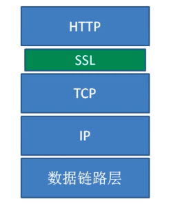
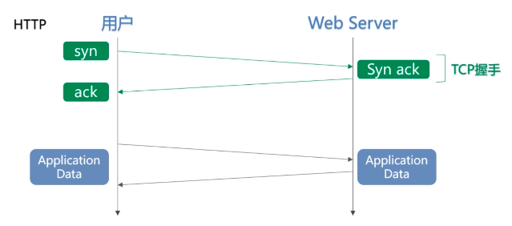
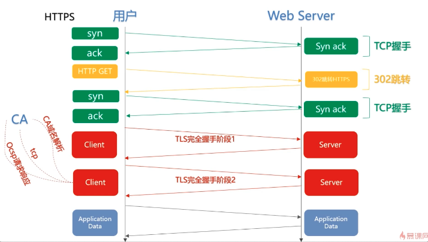

# 安全的 HTTPS

> 为什么要使用 HTTPS ？

虽然 HTTP 有很多优秀且方便的特性，但是也同样具有一些不足之处：

1. 通信使用明文（不加密）， 内容可能会被窃听
2. 不验证通信方的身份， 因此有可能遭遇伪装
3. 无法证明报文的完整性， 所以有可能已遭篡改

为了有效防止这些弊端，有必要使用 HTTPS。SSL 提供认证和加密处理及摘要功能。仅靠 HTTP 确保完整性是非常困难的，因此 通过和其他协议组合使用来实现这个目标。

## HTTPS协议概述

HTTPS 并非是应用层的一种新协议。只是 HTTP 通信接口部分用 SSL（Secure Socket Layer）和 TLS（Transport Layer Security）协议代 替而已。 TLS 是**传输层加密协议**，他的前身是 SSL 协议。

HTTP 和 TLS 的位置如图所示，TLS 建立在传输层和应用层之间，TLS实际上是 TCP 之上建立了一个加密通道，TLS 协议主要有5各部分，它包含应用数据层协议、握手协议、报警协议、加密消息确认协议和心跳协议。

常用的 HTTP 协议是 HTTP/1.1，而常用的 TLS 协议有 TLS/1.2、 TLS/1.1、 TLS/1.0和 SSL/3.0这么几个版本。TLS/1.0和 SSL/3.0其实都存在着一定的安全漏洞，TLS/1.2、 TLS/1.1则没有已知的安全漏洞并且有着大量的访问速度和性能的提升，目前 TLS/1.3 已经发布，相比较之前的版本，有本质上的提升。

## HTTPS 功能介绍

为了解决前面提到的 HTTP 的一些弊端，HTTPS 就做了以下的功能用来强化自身的能力：

- 内容加密
  - 对称内容加密
  - 非对称秘钥交换
- 身份认证
  - 数字证书
- 数据完整性

## 使用成本

- 证书费用以及更新维护
- HTTPS 降低用户访问速度
- 消耗 CPU 资源，需要增加大量机器

## 对性能的影响

#### 协议交互所增加的网络 RTT（round trip time 往返时延）

    
     
    

      HTTP 通讯机制
  	

对比

    
     
    

      HTTPS 通讯机制
  	

如上面两个通讯机制的比对，明显 HTTPS 的通讯步骤要远远麻烦与 HTTP 的通讯，这就意味着 HTTPS 要产生更多的 RTT，最多时会产生7个 RTT。

步骤1：三次握手建立 TCP 连接，耗时一个 RTT(1)

步骤2：客户端发送 GET 请求，服务器端返回 302 跳转到 HTTP，此时会产生一个 RTT(2) 和 302 的跳转延时（这里会有一个情况，就是用户一般不会输入完整的 https 地址，而是通过简称，如：baidu.com、jd.com，此时浏览器会先访问 http 域名，然后通过 302 跳转至对应的 https 地址）

步骤3：通过 302 跳转到 https 服务器之后，由于端口号和服务器的不同，会重新发送新的 http 请求，完成三次握手，建立 TCP 连接

步骤4：TLS 完全握手阶段1，此处会消耗一个 RTT(3)，此处会完成加密套件的协商和证书的身份确认，服务器和客户端会协商出相同的秘钥交换算法、对称加密算法、内容一致性校验算法、证书签名算法等，浏览器接收到证书后，也会校验证书的有效性。

步骤5：浏览器获取证书中的 CA 域名，如果 CA 域名没有命中缓存的话，浏览器需要解析 CA 域名的 DNS（消耗一个 RTT）(4)，DNS 解析完成拿到 ip，需要进行三次握手，建立 CA 站点的 TCP连接（消耗一个 RTT）(5)，然后浏览器发送 Ocsp（在线证书状态协议） 请求获取响应（消耗一个 RTT）(6)。

步骤6：TLS 完全握手阶段2，主要进行的是秘钥协商（消耗一个 RTT 和计算时间）(7)。

步骤7：上面的完全握手结束后，浏览器和服务器会进行应用层的通讯，也就是 HTTP 的数据传输，跟常规的 HTTP 方式几乎是一致的。

经过这么多的步骤，最多会产生7个 RTT，但并不是所有的请求都会产生7个 RTT 才会完成 HTTPS 的首次请求交互，比如 CA 命中了缓存，则不会发生 CA 解析。但从上述结果来看， HTTPS 的网络消耗一定是会略大约 HTTP 的。
