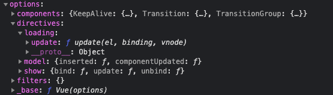
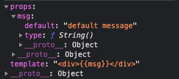
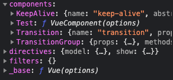
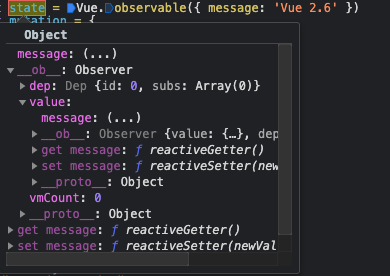

# Vue进阶

## $on 和 $emit

```html
<html>

<head>
    <title>$emit 和 $on</title>
    <script src="https://cdn.jsdelivr.net/npm/vue/dist/vue.js"></script>
</head>

<body>
    <div id="root">
        <button @click="boost">触发事件</button>
    </div>
    <script>
        new Vue({
            el: '#root',
            data() {
                return {
                    message: 'hello vue'
                }
            },
            created() {
                this.$on('my_events', this.handleEvents)
            },
            methods: {
                handleEvents(e) {
                    console.log(this.message, e)
                },
                boost() {
                    this.$emit('my_events', 'my params')
                }
            }
        })
    </script>
</body>

</html>
```

$on 源码

```js
/*在vm实例上绑定事件方法*/
Vue.prototype.$on = function (event, fn) {
    var vm = this;
    /*如果是数组的时候，则递归$on，为每一个成员都绑定上方法*/
    if (Array.isArray(event)) {
        for (var i = 0, l = event.length; i < l; i++) {
            vm.$on(event[i], fn);
        }
    } else {
        (vm._events[event] || (vm._events[event] = [])).push(fn);
        // optimize hook:event cost by using a boolean flag marked at registration
        // instead of a hash lookup
        /*这里在注册事件的时候标记bool值也就是个标志位来表明存在钩子，而不需要通过哈希表的方法来查找是否有钩子，这样做可以减少不必要的开销，优化性能。*/
        if (hookRE.test(event)) {
            vm._hasHookEvent = true;
        }
    }
    return vm
};
```

$emit 源码

```js
/*触发一个事件方法*/
Vue.prototype.$emit = function (event) {
    var vm = this;
    {
        //  事件名称转化为小写并做相应的检查
        var lowerCaseEvent = event.toLowerCase();
        if (lowerCaseEvent !== event && vm._events[lowerCaseEvent]) {
            tip(
                "Event \"" + lowerCaseEvent + "\" is emitted in component " +
                (formatComponentName(vm)) + " but the handler is registered for \"" + event + "\". " +
                "Note that HTML attributes are case-insensitive and you cannot use " +
                "v-on to listen to camelCase events when using in-DOM templates. " +
                "You should probably use \"" + (hyphenate(event)) + "\" instead of \"" + event + "\"."
            );
        }
    }
    var cbs = vm._events[event];
    if (cbs) {
        /*将类数组的对象转换成数组*/
        cbs = cbs.length > 1 ? toArray(cbs) : cbs;
        var args = toArray(arguments, 1);
        var info = "event handler for \"" + event + "\"";
        /*遍历执行*/
        for (var i = 0, l = cbs.length; i < l; i++) {
            invokeWithErrorHandling(cbs[i], vm, args, vm, info);
        }
    }
    return vm
};

function invokeWithErrorHandling(
    handler,
    context,
    args,
    vm,
    info
) {
    var res;
    try {
        res = args ? handler.apply(context, args) : handler.call(context);
        if (res && !res._isVue && isPromise(res) && !res._handled) {
            res.catch(function (e) { return handleError(e, vm, info + " (Promise/async)"); });
            // issue #9511
            // avoid catch triggering multiple times when nested calls
            res._handled = true;
        }
    } catch (e) {
        handleError(e, vm, info);
    }
    return res
}
```

## directive 用法

```html
<html>
  <head>
    <title>directive 用法</title>
    <script src="https://cdn.jsdelivr.net/npm/vue/dist/vue.js"></script>
  </head>
  <body>
    <div id="root">
      <div v-loading="isLoading">{{data}}</div>
      <button @click="update">更新</button>
    </div>
    <script>
      Vue.directive('loading', {
        // update: 被绑定于元素所在模板更新时调用，而且无论绑定值是否有变化，通过比较更新前后的绑定值，忽略不必要的模板更新
        update(el, binding, vnode) {
          if (binding.value) {
            const div = document.createElement('div')
            div.innerText = '加载中...'
            div.setAttribute('id', 'loading')
            div.style.position = 'absolute'
            div.style.left = 0
            div.style.top = 0
            div.style.width = '100%'
            div.style.height = '100%'
            div.style.display = 'flex'
            div.style.justifyContent = 'center'
            div.style.alignItems = 'center'
            div.style.color = 'white'
            div.style.background = 'rgba(0, 0, 0, .7)'
            document.body.append(div)
          } else {
            document.body.removeChild(document.getElementById('loading'))
          }
        }
      })
      new Vue({
        el: '#root',
        data() {
          return {
            isLoading: false,
            data: ''
          }
        },
        methods: {
          update() {
            this.isLoading = true
            setTimeout(() => {
              this.data = '用户数据'
              this.isLoading = false
            }, 3000)
          }
        }
      })
    </script>
  </body>
</html>
```

directive相关源码

```js
ASSET_TYPES.forEach(function (type) {
    Vue[type] = function (
        id,
        definition
    ) {
        if (!definition) {
            return this.options[type + 's'][id]
        } else {
            /* istanbul ignore if */
            if (type === 'component') {
                validateComponentName(id);
            }
            if (type === 'component' && isPlainObject(definition)) {
                definition.name = definition.name || id;
                definition = this.options._base.extend(definition);
            }
            if (type === 'directive' && typeof definition === 'function') {
                definition = { bind: definition, update: definition };
            }
            this.options[type + 's'][id] = definition;
            return definition
        }
    };
});
```

上述例子中我们传入的 type 是 directive，但是 definition 的类型是一个 Object, 因此会执行`this.options[type + 's'][id] = definition;`,添加到 vue 对象 options中，如下图：



如果直接传入一个 fn，那么会将这个 fn 直接绑定到 directive 的插入时机和更新时机的方法中，`definition = { bind: definition, update: definition };`，如下图：


## component 用法

```html
<html>
  <head>
    <title>Vue.component 用法</title>
    <script src="https://cdn.jsdelivr.net/npm/vue/dist/vue.js"></script>
  </head>
  <body>
    <div id="root">
      <Test :msg="message"></Test>
    </div>
    <script>
      Vue.component('Test', {
        template: '<div>{{msg}}</div>',
        props: {
          msg: {
            type: String,
            default: 'default message'
          }
        }
      })
      new Vue({
        el: '#root',
        data() {
          return {
            message: "Test Component"
          }
        }
      })
    </script>
  </body>
</html>
```

component 相关源码

```js
ASSET_TYPES.forEach(function (type) {
    Vue[type] = function (
        id,
        definition
    ) {
        if (!definition) {
            return this.options[type + 's'][id]
        } else {
            /* istanbul ignore if */
            if (type === 'component') {
                validateComponentName(id);
            }
            if (type === 'component' && isPlainObject(definition)) {
                definition.name = definition.name || id;
                definition = this.options._base.extend(definition);
            }
            if (type === 'directive' && typeof definition === 'function') {
                definition = { bind: definition, update: definition };
            }
            this.options[type + 's'][id] = definition;
            return definition
        }
    };
});
```

上述例子，通过上面函数可以获得当前 id 为 `id = "Test"`，definition 为



后续继续判断 type 是否为 `component`以及当前的 definition 是否是一个对象，通过 Vue.extend 方法处理返回一个 VueComponent 的构造函数，此函数包含初始化一个组件是所包含的属性和方法。最后将 definition 放入 options 中，得到一个全局注册的组件 Test，如下：



## extnd 用法

```html
<head>
    <title>Vue.extend 用法</title>
    <script src="https://cdn.jsdelivr.net/npm/vue/dist/vue.js"></script>
</head>

<body>
    <div id="root">
        <Test :msg="message"></Test>
    </div>
    <script>
        const component = Vue.extend({
            template: '<div>{{msg}}</div>',
            props: {
                msg: {
                    type: String,
                    default: 'default message'
                }
            },
            name: 'Test'
        })
        Vue.component('Test')
        new Vue({
            el: '#root',
            data() {
                return {
                    message: "Test Extend Component"
                }
            }
        })
    </script>
</body>

</html>
```

extend 源码

```js
function initExtend (Vue) {
  /*
    每个构造函数实例（包括Vue本身）都会有一个唯一的cid
    它为我们能够创造继承创建自构造函数并进行缓存创造了可能
  */
  Vue.cid = 0
  let cid = 1

  /**
   * Class inheritance
   */
   /*
   使用基础 Vue 构造器，创建一个“子类”。
   其实就是扩展了基础构造器，形成了一个可复用的有指定选项功能的子构造器。
   参数是一个包含组件option的对象。  https://cn.vuejs.org/v2/api/#Vue-extend-options
   */
  Vue.extend = function (extendOptions) {
    extendOptions = extendOptions || {}
    /*父类的构造*/
    const Super = this
    /*父类的cid*/
    const SuperId = Super.cid
    const cachedCtors = extendOptions._Ctor || (extendOptions._Ctor = {})
    /*如果构造函数中已经存在了该cid，则代表已经extend过了，直接返回*/
    if (cachedCtors[SuperId]) {
      return cachedCtors[SuperId]
    }

    const name = extendOptions.name || Super.options.name
    if (process.env.NODE_ENV !== 'production') {
      /*name只能包含字母与连字符*/
      if (!/^[a-zA-Z][\w-]*$/.test(name)) {
        warn(
          'Invalid component name: "' + name + '". Component names ' +
          'can only contain alphanumeric characters and the hyphen, ' +
          'and must start with a letter.'
        )
      }
    }

    /*
      Sub构造函数其实就一个_init方法，这跟Vue的构造方法是一致的，在_init中处理各种数据初始化、生命周期等。
      因为Sub作为一个Vue的扩展构造器，所以基础的功能还是需要保持一致，跟Vue构造器一样在构造函数中初始化_init。
    */
    const Sub = function VueComponent (options) {
      this._init(options)
    }
    /*继承父类*/
    Sub.prototype = Object.create(Super.prototype)
    /*构造函数*/
    Sub.prototype.constructor = Sub
    /*创建一个新的cid*/
    Sub.cid = cid++
    /*将父组件的option与子组件的合并到一起(Vue有一个cid为0的基类，即Vue本身，会将一些默认初始化的option何入)*/
    Sub.options = mergeOptions(
      Super.options,
      extendOptions
    )
    /*es6语法，super为父类构造*/
    Sub['super'] = Super

    // For props and computed properties, we define the proxy getters on
    // the Vue instances at extension time, on the extended prototype. This
    // avoids Object.defineProperty calls for each instance created.
    /*在扩展时，我们将计算属性以及props通过代理绑定在Vue实例上（也就是vm），这也避免了Object.defineProperty被每一个实例调用*/
    if (Sub.options.props) {
      /*初始化props，将option中的_props代理到vm上*/
      initProps(Sub)
    }
    if (Sub.options.computed) {
      /*处理计算属性，给计算属性设置defineProperty并绑定在vm上*/
      initComputed(Sub)
    }

    // allow further extension/mixin/plugin usage
    /*加入extend、mixin以及use方法，允许将来继续为该组件提供扩展、混合或者插件*/
    Sub.extend = Super.extend
    Sub.mixin = Super.mixin
    Sub.use = Super.use

    // create asset registers, so extended classes
    // can have their private assets too.
    /*使得Sub也会拥有父类的私有选项（directives、filters、components）*/
    ASSET_TYPES.forEach(function (type) {
      Sub[type] = Super[type]
    })
    // enable recursive self-lookup
    /*把组件自身也加入components中，为递归自身提供可能（递归组件也会查找components是否存在当前组件，也就是自身）*/
    if (name) {
      Sub.options.components[name] = Sub
    }

    // keep a reference to the super options at extension time.
    // later at instantiation we can check if Super's options have
    // been updated.
    /*保存一个父类的options，此后我们可以用来检测父类的options是否已经被更新*/
    Sub.superOptions = Super.options，
    /*extendOptions存储起来*/
    Sub.extendOptions = extendOptions
    /*保存一份option，extend的作用是将Sub.options中的所有属性放入{}中*/
    Sub.sealedOptions = extend({}, Sub.options)

    // cache constructor
    /*缓存构造函数（用cid），防止重复extend*/
    cachedCtors[SuperId] = Sub
    return Sub
  }
}

/*初始化props，将option中的_props代理到vm上*/
function initProps (Comp) {
  const props = Comp.options.props
  for (const key in props) {
    proxy(Comp.prototype, `_props`, key)
  }
}

/*处理计算属性，给计算属性设置defineProperty并绑定在vm上*/
function initComputed (Comp) {
  const computed = Comp.options.computed
  for (const key in computed) {
    defineComputed(Comp.prototype, key, computed[key])
  }
}
```

## extend 进阶用法

::: tip
跟指令(directive)所不同的是，directive 是修改某个状态，加载某个dom，而 extend 是需要主动触发的，所以等于给Vue直接加api，实际开发过程中可以将类似的方法抽象，跟Vue.use()配合，做成类似插件机制的api，增强项目的饱和度
:::

```html
<html>
  <head>
    <title>Vue.extend 用法2</title>
    <script src="https://cdn.jsdelivr.net/npm/vue/dist/vue.js"></script>
    <style>
      #loading-wrapper {
        position: fixed;
        top: 0;
        left: 0;
        display: flex;
        justify-content: center;
        align-items: center;
        width: 100%;
        height: 100%;
        background: rgba(0,0,0,.7);
        color: #fff;
      }
    </style>
  </head>
  <body>
    <div id="root">
      <button @click="showLoading">显示Loading</button>
    </div>
    <script>
      function Loading(msg) {
        const LoadingComponent = Vue.extend({
          template: '<div id="loading-wrapper">{{msg}}</div>',
          props: {
            msg: {
              type: String,
              default: msg
            }
          },
          name: 'LoadingComponent'
        })
        const div = document.createElement('div')
        // 此处创建的 id 为 loading-wrapper 要和上面组件的 id 名一致，否则后面进行移除的时候回找不到
        div.setAttribute('id', 'loading-wrapper')
        document.body.append(div)
        // 将实例化的组件挂载到创建的 loading-wrapper 上
        // 上面 extend 的 div 会覆盖当前创建的这个 loading-wrapper 的 div
        // 自己创建的组件替换掉原来创建的 div
        new LoadingComponent().$mount('#loading-wrapper')
        return () => {
          document.body.removeChild(document.getElementById('loading-wrapper'))
        }
      }
      Vue.prototype.$loading = Loading
      new Vue({
        el: '#root',
        methods: {
          showLoading() {
            const hide = this.$loading('正在加载，请稍等...')
            setTimeout(() => {
              hide()
            }, 2000)
          }
        }
      })
    </script>
  </body>
</html>
```

## use 用法

```html
<html>
  <head>
    <title>Vue.use 用法</title>
    <script src="https://cdn.jsdelivr.net/npm/vue/dist/vue.js"></script>
    <style>
      #loading-wrapper {
        position: fixed;
        top: 0;
        left: 0;
        display: flex;
        justify-content: center;
        align-items: center;
        width: 100%;
        height: 100%;
        background: rgba(0,0,0,.7);
        color: #fff;
      }
    </style>
  </head>
  <body>
    <div id="root">
      <button @click="showLoading">显示Loading</button>
    </div>
    <script>
      // 可通过 对象: install 的形式
      // const loadingPlugin = { install: ... }
      // 也可通过 function 的形式直接注册
      // const loadingPlugin = { function(vm) {... } }
      const loadingPlugin = {
        install: function(vm) {
          const LoadingComponent = vm.extend({
            template: '<div id="loading-wrapper">{{msg}}</div>',
            props: {
              msg: {
                type: String,
                default: 'loading...'
              }
            }
          }, 'LoadingComponent')
          function Loading(msg) {
            const div = document.createElement('div')
            div.setAttribute('id', 'loading-wrapper')
            document.body.append(div)
            new LoadingComponent({
              props: {
                msg: {
                  type: String,
                  default: msg
                }
              }
            }).$mount('#loading-wrapper')
            return () => {
              document.body.removeChild(document.getElementById('loading-wrapper'))
            }
          }
          vm.prototype.$loading = Loading
        }
      }
      Vue.use(loadingPlugin)
      new Vue({
        el: '#root',
        methods: {
          showLoading() {
            const hide = this.$loading('正在加载，请稍等...')
            setTimeout(() => {
              hide()
            }, 2000)
          }
        }
      })
    </script>
  </body>
</html>
```

use 相关源码

```js
/*初始化use*/
function initUse(Vue) {
    Vue.use = function (plugin) {
        var installedPlugins = (this._installedPlugins || (this._installedPlugins = []));
        /*检测该插件是否已经被安装*/
        if (installedPlugins.indexOf(plugin) > -1) {
            return this
        }

        // additional parameters
        var args = toArray(arguments, 1);
        args.unshift(this);
        if (typeof plugin.install === 'function') {
            /*install执行插件安装*/
            plugin.install.apply(plugin, args);
        } else if (typeof plugin === 'function') {
            plugin.apply(null, args);
        }
        installedPlugins.push(plugin);
        return this
    };
}
```

从 debugger 过程中可以看出，在执行`Vue.use`的过程中，通过 install 的加载，将 loadingPlugin 中 Loading 方法最后挂载到 vm 的原型链 $loading 的方法上，最后再将这个 plugin 放入 _installedPlugins 里面

## observable 用法

```html
<html>

<head>
    <title>Vue.observable</title>
    <script src="https://cdn.jsdelivr.net/npm/vue/dist/vue.js"></script>
</head>

<body>
    <div id="root">
        {{message}}
        <button @click="change">Change</button>
    </div>
    <script>
        const state = Vue.observable({ message: 'Vue 2.6' })
        const mutation = {
            setMessage(value) {
                state.message = value
            }
        }
        new Vue({
            el: '#root',
            computed: {
                message() {
                    return state.message
                }
            },
            methods: {
                change() {
                    mutation.setMessage('Vue 3.0')
                }
            }
        })
    </script>
</body>

</html>
```

observable 相关源码

```js
// 2.6 explicit observable API
Vue.observable = function (obj) {
    observe(obj);
    return obj
};

function observe(value, asRootData) {
    if (!isObject(value) || value instanceof VNode) {
        return
    }
    var ob;
    if (hasOwn(value, '__ob__') && value.__ob__ instanceof Observer) {
        ob = value.__ob__;
    } else if (
        shouldObserve &&
        !isServerRendering() &&
        (Array.isArray(value) || isPlainObject(value)) &&
        Object.isExtensible(value) &&
        !value._isVue
    ) {
        ob = new Observer(value);
    }
    if (asRootData && ob) {
        ob.vmCount++;
    }
    return ob
}

/**
* Observer class that is attached to each observed
* object. Once attached, the observer converts the target
* object's property keys into getter/setters that
* collect dependencies and dispatch updates.
*/
var Observer = function Observer(value) {
    this.value = value;
    this.dep = new Dep();
    this.vmCount = 0;
    def(value, '__ob__', this);
    if (Array.isArray(value)) {
        if (hasProto) {
            protoAugment(value, arrayMethods);
        } else {
            copyAugment(value, arrayMethods, arrayKeys);
        }
        this.observeArray(value);
    } else {
        this.walk(value);
    }
};


/**
* Walk through all properties and convert them into
* getter/setters. This method should only be called when
* value type is Object.
*/
Observer.prototype.walk = function walk(obj) {
    var keys = Object.keys(obj);
    for (var i = 0; i < keys.length; i++) {
        defineReactive$$1(obj, keys[i]);
    }
};

/**
* Define a reactive property on an Object.
*/
function defineReactive$$1(
    obj,
    key,
    val,
    customSetter,
    shallow
) {
    var dep = new Dep();

    var property = Object.getOwnPropertyDescriptor(obj, key);
    // 对象无法被修改时， 没必要做相关响应式的操作，直接返回
    if (property && property.configurable === false) {
        return
    }

    // cater for pre-defined getter/setters
    var getter = property && property.get;
    var setter = property && property.set;
    if ((!getter || setter) && arguments.length === 2) {
        val = obj[key];
    }

    var childOb = !shallow && observe(val);
    // 对对象属性的一个描述
    Object.defineProperty(obj, key, {
        enumerable: true,
        configurable: true,
        get: function reactiveGetter() {
            var value = getter ? getter.call(obj) : val;
            if (Dep.target) {
                dep.depend();
                if (childOb) {
                    // 依赖收集
                    childOb.dep.depend();
                    if (Array.isArray(value)) {
                        dependArray(value);
                    }
                }
            }
            return value
        },
        set: function reactiveSetter(newVal) {
            var value = getter ? getter.call(obj) : val;
            /* eslint-disable no-self-compare */
            if (newVal === value || (newVal !== newVal && value !== value)) {
                return
            }
            /* eslint-enable no-self-compare */
            if (customSetter) {
                customSetter();
            }
            // #7981: for accessor properties without setter
            if (getter && !setter) { return }
            if (setter) {
                setter.call(obj, newVal);
            } else {
                val = newVal;
            }
            childOb = !shallow && observe(newVal);
            //  响应式更新
            dep.notify();
        }
    });
}
```

更新完后的 `state` 会被新增 `__ob__` 属性，其中包含要被响应式更新的数据 `messgae: {'Vue 2.6'}`，此时 `messgae: {'Vue 2.6' }` 已经被添加到响应式中，并且新增了响应式更新所需要的相关方法，`get: reactiveGetter()`、`set: reactiveSetter(newVal)`等，此时的 `state` 已经被添加为一个响应式的对象，使用的时候需要配合计算属性 `computed` 进行处理。后续如下图：



适用于小型项目不用vuex的情况下，可设置全局的 `observable` 来进行某些状态管理。

## slot 用法

```html
<html>

<head>
    <title>插槽 slot</title>
    <script src="https://cdn.jsdelivr.net/npm/vue/dist/vue.js"></script>
</head>

<body>
    <div id="root">
        <div>案例1：slot的基本用法</div>
        <Test>
            <template #header="{user}">
                <div>自定义header({{user.a}})</div>
            </template>
            <template v-slot="{user}">
                <div>自定义body({{user.b}})</div>
            </template>
        </Test>
    </div>
    <div id="root2">
        <div>案例2：Vue2.6新特性 - 动态slot</div>
        <Test>
            <template v-slot:[section]="{section}">
                <div>this is {{section}}</div>
            </template>
        </Test>
        <button @click="change">switch header and body</button>
    </div>
    <script>
        Vue.component('Test', {
            template:
                '<div>' +
                '<slot name="header" :user="obj" :section="\'header\'">' +
                '<div>默认header</div>' +
                '</slot>' +
                '<slot :user="obj" :section="\'body\'">默认body</slot>' +
                '</div>',
            data() {
                return {
                    obj: { a: 1, b: 2 }
                }
            }
        })
        new Vue({ el: '#root' })
        new Vue({
            el: '#root2',
            data() {
                return {
                    section: 'header'
                }
            },
            methods: {
                change() {
                    this.section === 'header' ?
                        this.section = 'default' :
                        this.section = 'header'
                }
            }
        })
    </script>
</body>

</html>
```
