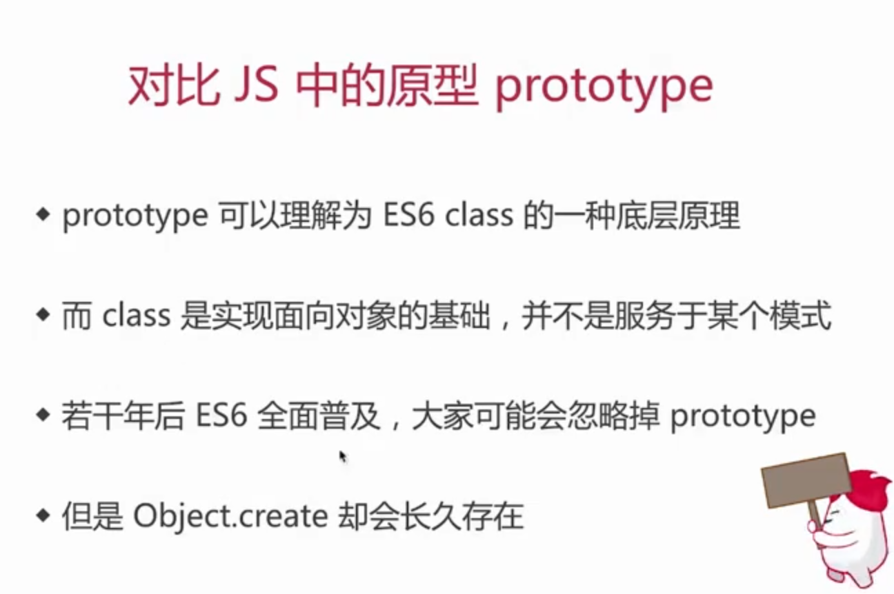
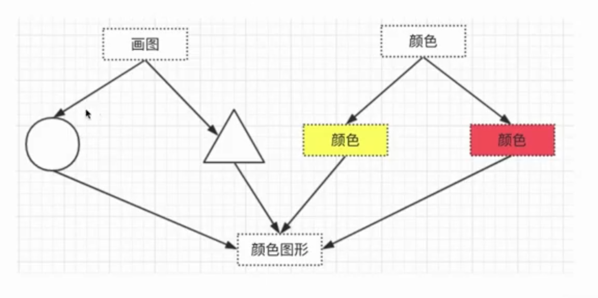

# 其他设计模式

优先级划分依据

1. 不常用
2. 对应不到经典场景

## 原型模式

一、概念

1. clone自己，生成一个新的对象（不是new）
2. java默认clone接口，不用自己实现

```js
// Object.cerate 用到了原型模式的思想（虽然不是 java 中的 clone）
// 基于一个原型创建一个对象
var prototype = {
    getName: function() {
        return this.first + "" + this.last
    },
    say: function() {
        console.log("hello")
    }
}

// 基于原型创建 x
var x = Object.cerate(prototype)
x.first = 'A'
x.last = 'B'
x.getName() // AB
x.say() // hello

// 基于原型创建 y
var y = Object.cerate(prototype)
y.first = 'C'
y.last = 'D'
y.getName() // CD
y.say() // hello
```



## 桥接模式

1. 用于把抽象化与实现化解耦
2. 使得二者可以独立变化
3. (未找到JS中的经典应用)
4. 抽象和实现分离，解耦
5. 符合开放封闭





## 组合模式

1. 生成树结构，表示“整体-部分”关系
2. 让整体和部分都具有一致的操作方式

演示

1. JS经典应用中，没找到过于复杂的数据类型
2. 虚拟DOM中的vnode是这种形式，但数据类型简单（嵌套方式）
3. 用JS实现一个菜单，不算经典应用，与业务相关

--

1. 将整体和单个节点的操作抽象出来
2. 符合开放封闭原则

## 享元模式

1. 共享内存（主要考虑内存，而非效率）
2. 相同的数据，共享使用
3. JS未找到经典场景
4. 将相同的部分抽象出来
5. 符合封闭开放原则

## 策略模式

1. 不同策略分开处理，而不是混合在一起
2. 避免出现大量的if...else 或者 switch...case
3. 符合开放封闭原则

## 模板方法模式

模板模式 在模板模式(Template Pattern)中,一个抽象类公开定义了执行它的方法的方式/模板。它的子类可以按需要重写方法实现,但调用将以抽象类中定义的方式进行。

## 和职责链模式

1. 一步操作可能分位多个职责角色来完成
2. 把这些角色都分开，用一个链串起来
3. 将发起者和各个处理者进行隔离

```js
class Action {
    constructor (name) {
        this.name = name
        this.nextAction = null // 下一步谁审批
    }
    setNextAction(action) {
        this.nextAction = action
    }

    handle() {
        console.log(`${this.name} 审批`);
        if (this.nextAction !== null) {
            this.nextAction.handle()
        }
    }
}

// test

const a1 = new Action("组长")
const a2 = new Action("经理")
const a3 = new Action("总监")

a1.setNextAction(a2)
a2.setNextAction(a3)
a1.handle()
```

JS中的链式操作

1. 职责链模式和业务结合比较多，JS中能联想到链式操作
2. jQuery中的链式操作，Promise.then的链式操作

## 命令模式

1. 执行命令时，执行者和发布者分开
2. 中间加入命令对象，作为中转站

```js
// 接收者
class Receiver {
    exec() {
        console.log("执行");
    }
}

// 命令者
class Command {
    constructor (receiver) {
        this.receiver = receiver
    }
    cmd() {
        console.log("执行命令")
        this.receiver.exec()
    }
}

// 触发者
class Invoker {
    constructor (command) {
        this.command = command
    }

    invoke() {
        console.log("开始")
        this.command.cmd()
    }
}

// test

const solider = new Receiver()
const trumpeter = new Command(solider)
const general = new Invoker(trumpeter)
general.invoke()
```

应用

1. 网页富文本编辑器操作，浏览器封装了一个命令对象
2. document.execCommand("bold") // 加粗
3. document.execCommand("undo") // 撤销

## 备忘录模式

1. 随时记录一个对象的状态
2. 随时可以恢复之前的某个状态（如撤销）
3. 未找到JS中的经典应用，有一些业务工具使用，比如编辑器

```js
class Memento {
    constructor (content) {
        this.content = content
    }

    getContent() {
        return this.content
    }
}

class CareTaker {
    constructor () {
        this.list = []
    }

    add(memento) {
        this.list.push(memento)
    }

    get(index) {
        return this.list[index]
    }
}

class Editor {
    constructor () {
        this.content = null
    }

    setContent(content) {
        this.content = content
    }

    getContent() {
        return this.content
    }

    saveContentToMemento() {
        return new Memento(this.content)
    }
    getContentFromMemento(memento) {
        this.content = memento.getContent()
    }

}

// test

let editor = new Editor()
let careTaker = new CareTaker()

editor.setContent('111')
editor.setContent('222')
careTaker.add(editor.saveContentToMemento()) // 将当前内容备份
editor.setContent('333')
careTaker.add(editor.saveContentToMemento()) // 将当前内容备份
editor.setContent('444')

console.log(editor.getContent()); // 444
editor.getContentFromMemento(careTaker.get(1)) // 相当于撤销
console.log(editor.getContent()); // 333
editor.getContentFromMemento(careTaker.get(0)) // 相当于撤销
console.log(editor.getContent()); // 222
```

## 中介者模式

中介者(Mediator)模式的定义:定义一个中介对象来封装一系列对象之间的交互,使原有对象之间的耦合松散,且可以独立地改变它们之间的交互。中介者模式又叫调停模式,它是迪米特法则的典型应用


```js
class A {
    constructor () {
        this.number = 0
    }

    setNumber(num, m) {
        this.number = num
        if (m) {
            m.setB()
        }
    }
}

class B {
    constructor () {
        this.number = 0
    }

    setNumber(num, m) {
        this.number = num
        if (m) {
            m.setA()
        }
    }
}

class Mediator {
    constructor (a, b) {
        this.a = a
        this.b = b
    }

    setA() {
        let num = this.b.number
        this.a.setNumber(num / 100)
    }

    setB() {
        let num = this.a.number
        this.b.setNumber(num * 100)

    }
}

// test

let a = new A()

let b = new B()

let m = new Mediator(a, b)

a.setNumber(100, m)
console.log(a.number, b.number); // 100 10000

b.setNumber(100, m)
console.log(a.number, b.number); // 1 100
```
