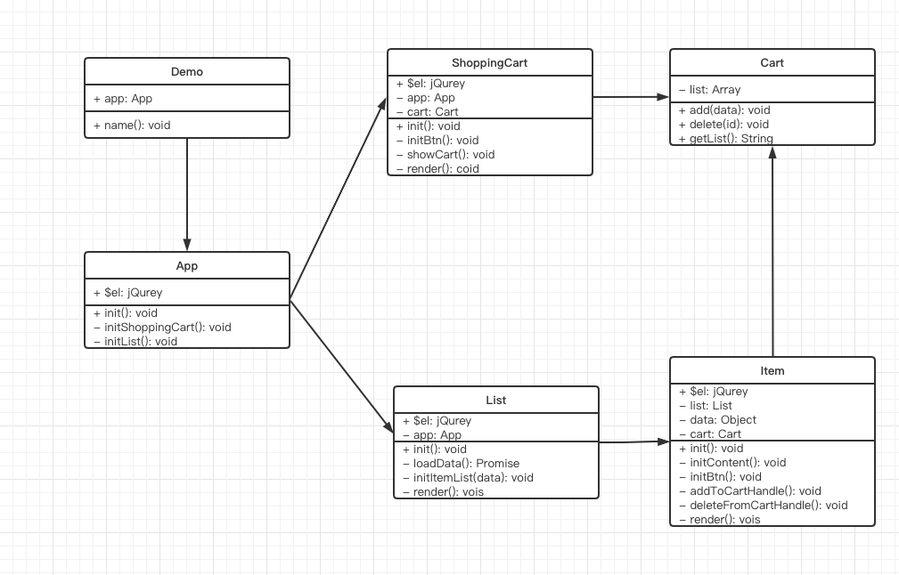

# 用设计模式实现一个购物车

## UML类图分析各个模块



## 文件结构

```md
├─ demo
│  ├─ App.js
│  ├─ List
│  │  ├─ CreateItem.js
│  │  ├─ Item.js
│  │  └─ List.js
│  ├─ README.md
│  ├─ ShoppingCart
│  │  ├─ GetCart.js
│  │  └─ ShoppingCart.js
│  ├─ api
│  │  └─ list.json
│  ├─ config
│  │  └─ config.js
│  └─ util
│     └─ log.js
```

## 用到的设计模式

- 工厂模式： $('xxx')，商品创建 `$ 本身就是用工厂模式实现的，CreateItem.js`
- 单例模式： 购物车 `GetCart.js`
- 装饰器模式： 打点统计 `log.js`
- 观察者模式： 网页事件，Promise
- 状态模式： 添加到购物车 & 从购物车删除 `Item.js`
- 模板方法模式： 渲染有统一的方法，内部包含了各模块渲染 `可以参考各个 class 内部的init方法`
- 代理模式： 打折商品信息处理 `CreateItem.js`

## 代码实现

### api/list.json

```json
[
    {
        "id": 1,
        "name": "《巴黎圣母院》",
        "price": 244,
        "discount": 1
    },
    {
        "id": 2,
        "name": "《红与黑》",
        "price": 213,
        "discount": 1
    },
    {
        "id": 3,
        "name": "《仲夏夜之梦》",
        "price": 198,
        "discount": 0
    },
    {
        "id": 4,
        "name": "《三个火枪手》",
        "price": 187,
        "discount": 0
    },
    {
        "id": 5,
        "name": "《堂吉诃德》",
        "price": 207,
        "discount": 0
    }
]
```

### util/log.js

```js
export function log(type) {
    return function (target, name, descriptor) {
        let oldValue = descriptor.value
        descriptor.value = function (...args) {
            // 再次打印日志
            console.log(`日志上报 ${type}`);

            return oldValue.apply(this, args)
        }
        return descriptor
    }
}
```

### config/config.js

```js
export const GET_LIST = '/api/list.json'
```

### List/CreateItem.js

```js
// <------工厂模式 代理模式------>
import Item from './Item'

//用代理模式处理折扣显示
function createDiscount(itemData) {
    return new Proxy(itemData, {
        get(target, key, receiver) {
            if (key === "name") {
                return `${target[key]}【折扣】 `
            }
            if (key === "price") {
                return (target[key] * 100 * 0.8) / 100
            }
        }
    })
}

// 补充折扣商品逻辑
// 工厂函数
export default function (list, itemData) {
    if (itemData.discount) {
        itemData = createDiscount(itemData)
    }
    return new Item(list, itemData)
}
```

### List/Item.js

```js
import $ from 'jquery'
import getCart from '../ShoppingCart/GetCart'
import StateMachine from "javascript-state-machine"
import { log } from '../util/log'
export default class Item {
    constructor (list, data) {
        this.list = list
        this.data = data
        this.$item = $("<div>")
        this.cart = getCart()
    }

    initContent() {
        let $item = this.$item
        let data = this.data
        $item.append(`<p>名称：${data.name}</p>`)
        $item.append(`<p>价格：${data.price}元</p>`)
    }

    initBtn() {
        let $item = this.$item
        let $btn = $("<button>")

        let _this = this
        let fsm = new StateMachine({
            init: "加入购物车",
            transitions: [
                {
                    name: "addToCart",
                    from: "加入购物车",
                    to: "从购物车删除"
                }, {
                    name: "deleteFromCart",
                    from: "从购物车删除",
                    to: "加入购物车"
                }
            ],
            methods: {
                onAddToCart() {
                    _this.addToCartHandle()
                    updateText()
                },
                onDeleteFromCart() {
                    _this.deleteFromCartHandle()
                    updateText()
                }
            }
        })

        function updateText() {
            $btn.text(fsm.state)
        }
        // 状态模式
        $btn.click(() => {
            if (fsm.is("加入购物车")) {
                fsm.addToCart()
            } else {
                fsm.deleteFromCart()
            }
        })


        updateText()
        $item.append($btn)
    }
    // 添加到购物车
    @log("add")
    addToCartHandle() {
        this.cart.add(this.data)
    }
    // 从购物车删除
    @log("del")
    deleteFromCartHandle() {
        this.cart.del(this.data.id)
    }

    render() {
        this.list.$list.append(this.$item)
    }

    init() {
        this.initContent()
        this.initBtn()
        this.render()
    }
}
```

### List/List.js

```js
import $ from 'jquery'
import { GET_LIST } from '../config/config'
import createItem from './CreateItem'

export default class List {
    constructor (app, id) {
        this.app = app
        this.$list = $('<div>') // 创建一个div
    }

    // 获取数据
    loadData() {
        return fetch(GET_LIST).then(res => { return res.json() })
    }
    //生成列表
    initItemList(data) {
        data.forEach(itemData => {
            // 创建一个 item 然后 init
            let item = createItem(this, itemData)
            item.init()
        })
    }
    //渲染
    render() {
        this.app.$app.append(this.$list)
    }

    init() {
        this.loadData().then(data => {
            this.initItemList(data)
        }).then(() => {
            this.render()
        })
    }
}
```

### ShoppingCart/GetCart.js

```js
// <------单例模式------>
class Cart {
    constructor () {
        this.list = []
    }

    add(data) {
        this.list.push(data)
    }

    del(id) {
        this.list = this.list.filter(v => {
            if (v.id === id) {
                return false
            }
            return true
        })
    }

    getList() {
        return this.list.map(v => {
            return v.name
        }).join('\n')
    }
}

// 返回单例
let getCart = (function () {
    let cart
    return function () {
        if (!cart) {
            cart = new Cart()
        }
        return cart
    }
})()

export default getCart
```

### ShoppingCart/ShoppingCart.js

```js
import $ from 'jquery'
import getCart from '../ShoppingCart/GetCart'

export default class ShoppingCart {
    constructor (app) {
        this.app = app
        this.$shoppingCart = $("<div>").css({
            "paddig-bottom": "10px",
            "border-bottom": "1px solid #ccc"
        })
        this.cart = getCart()
    }

    initBtn() {
        let $btn = $('<button>购物车</button>')

        $btn.click(() => {
            this.showCart()
        })

        this.$shoppingCart.append($btn)
    }

    showCart() {
        alert(this.cart.getList())
    }

    render() {
        this.app.$app.append(this.$shoppingCart)
    }

    init() {
        this.initBtn()
        this.render()
    }
}
```

### App.js

```js
import $ from 'jquery'
import ShoppingCart from './ShoppingCart/ShoppingCart'
import List from './List/List'

// 初始化容器
export default class App {
    constructor (id) {
        this.$app = $(`#${id}`)
    }

    // 初始化购物车
    initShoppingCart() {
        let shoppingCart = new ShoppingCart(this)
        shoppingCart.init()
    }
    // 初始化列表
    initList() {
        let list = new List(this)
        list.init()
    }


    init() {
        this.initShoppingCart()
        this.initList()
    }
}
```