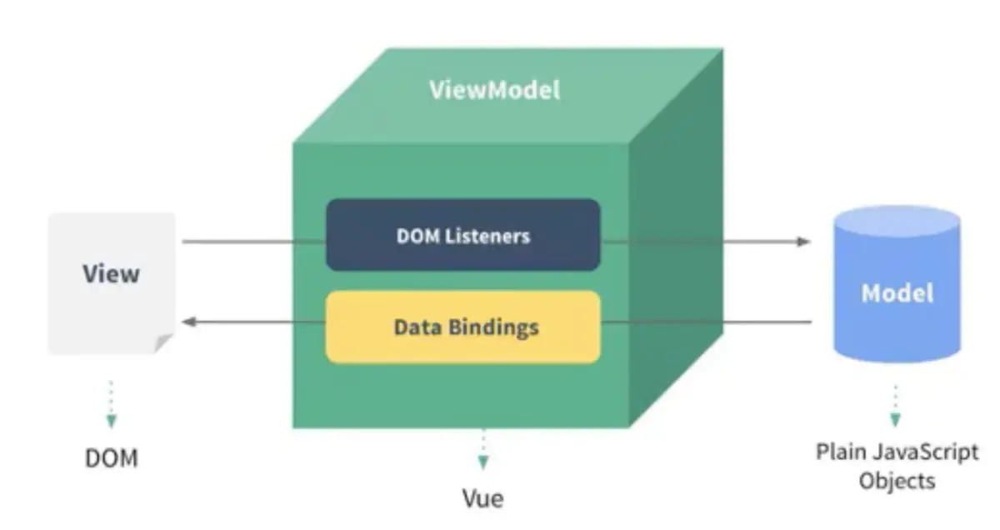

# Vue组件化和响应式

## 组件化

在 php，node 开发的时候其实就已经有所谓的组件化，但当时都是静态渲染，依赖于操作 DOM，后来在 Vue、React 中都做了组件化的创新，使用**数据驱动视图**，其中 Vue 中是通过 MVVM，React 中则是通过 setData。

### MVVM

如下图所示：


* Model：在 Vue 中其实就是组件中的 data、vuex等的数据源。
* View：是面向用户操作展示的操作界面，在 Vue 中其实就是 `<templete>` 包裹的 DOM 层。
* ViewMode：这个比较抽象，可以理解成是一个集合层，其中包含对 DOM 绑定的一系列事件监听和组件中 methods 等所包含的 Vue 指令等。

## 响应式

核心API：

* Object.defineProperty： Vue2.x中响应式核心，但是有一些缺点
* Proxy：Vue3.x中响应式核心，兼容性不好，ie11，部分安卓老系统不支持，并且无法polyfill

Object.defineProperty(obj, prop, descriptor)有三个参数分别表示为：

* obj: 目标对象
* prop: 需要操作的目标对象的属性名
* descriptor: 描述符

### 实现一个简单的试图更新

```js
function updateView() {
    console.log('视图更新')
}

function defineReactive(obj,key,value) {
    Object.defineProperty(obj,key, {
        enumerable: true,    /* 属性可枚举 */
        configurable: true,   /* 属性可被修改或删除 */
        get() {
            return value
        },
        set(newValue) {
            if(newValue !== value) {
                value = newValue
                updateView()
            }
        }
    })
}


function observer(target) {
    if(typeof target !== 'object' || !target) {
        return target
    }

    for (const key in target) {
        defineReactive(target)
    }
}

const data = {
    age: 24,
    name: 'lili'
}
// 监听数据
observer(data)
```

通过上述代码，我们实现了一个简单的响应式更新，当我们对 data 中的 age，name重新赋值时，浏览器会打印两次“视图更新”，但当 data 变成如下数据时，

```js
const data = {
    age: 24,
    name: 'lili',
    info: {
        address: '北京'
    }
}
```

更新 data.info.address 时，则不会打印“视图更新”，此时需对代码做修改，以**满足深度监听的条件**。

```js
...

function defineReactive(obj,key,value) {
    // 深度监听
    observer(value)

    Object.defineProperty(obj,key, {
        enumerable: true,    /* 属性可枚举 */
        configurable: true,   /* 属性可被修改或删除 */
        get() {
            return value
        },
        set(newValue) {
            if(newValue !== value) {
            // 深度监听
                observer(newValue)
                // value 一直处于闭包中，此时设置完成后，在通过 get 获取的值也是新值
                value = newValue
                updateView()
            }
        }
    })
}

...

```

通过递归对 data 中的嵌套对象进行更深一步的监听，这样更新 data.info.address 时，原视图就会被更新。

下面我们对 data 作如下操作，

```js
data.phone = '123456'
delete data.name
```

我们发现并没有打印“视图更新”，原因是当新增或者删除属性时，并不会触发 Object.defineProperty 方法，因此无法监听到属性的新增和删除，也就无法操作对应的视图更新，因此对于新增通过 Vue.set，对于删除通过 Vue.delete。

当 data 变成如下数据时，操作 data.nums.push(4)，数据发生更改，希望得到“视图更新”，但是并没有，因为 Object.defineProperty 不具备监听数组的能力。

```js
const data = {
    age: 24,
    name: 'lili',
    info: {
        address: '北京'
    },
    nums: [1,2,3]
}
```

改造如下：

```js
...

// 重新定义数组原型
const oldArrayProperty = Array.prototype
const arrProto  = Object.create(oldArrayProperty)   //创建新对象，原型指向 oldArrayProperty
['push','shift','unshift','pop','splice'].forEach(methods => {
    arrProto[methods] = function() {
        updateView()
        oldArrayProperty[methods].call(this,...arguments)
    }
})

function observer(target) {
    if(typeof target !== 'object' || !target) {
        return target
    }

    if(Array.isArray(target)) {
        target._proto_ = arrProto
    }

    for (const key in target) {
        defineReactive(target)
    }
}

...

```

通过上述制造，当我们使用 data.nums.push(4) 更新data时，则会打印“视图更新”。


由此可见，Object.defineProperty 存在一定的缺陷，比如：

1. 深度监听时，需要递归处理到底，一次性计算量大
2. 无法监听新增、删除属性（Vue.set  Vue.delete）
3. 无法监听数组，需要做特殊处理