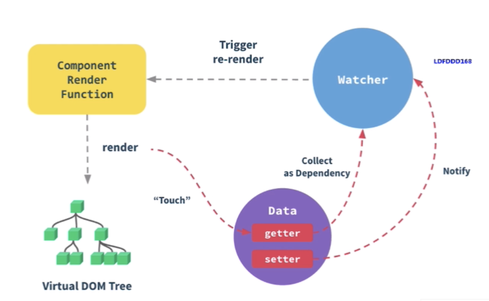

# 渲染流程

### 初次渲染过程

* 解析模板为 render 函数（或在开发环境已完成，vue-loader）
* 触发响应式，监听 data 属性 getter，setter
* 执行 render 函数（此过程中已通过 with 触发响应式 get），生成 vnode，然后再执行 patch(elm,vnode) 过程

```js
<template>
    <p>{{message}}</p>
</template>

export default{
    data() {
        return {
            message: 'hi', // 触发 get
            text: '123' // 不会触发 get，因为模板没用到，与视图无关
        }
    }
}
```

### 更新渲染过程

* 修改 data 属性，触发 setter（此前在 getter 已被监听）
* 重新执行 render 函数，生成 newVnode，然后再执行 patch(vnode,newVnode) 过程

完整的流程图如下，首先 Component Render Function 完成模板编译，生成 vnode（VDom tree），并且在 render 的过程中会 Touch Data 中的 getter产生依赖，此时会触发依赖收集，然后会通过 Watcher 将收集到的依赖观察起来。当去修改（setter） Data 中的数据时，会通过 Notify 触发 Watcher，看一下修改的数据是不是之前被依赖收集之后观察起来的数据，如果是的话，就会触发 Trigger re-render 重新渲染，生成新的 vnode，循环往复。



### 异步渲染

1. vue 组件是异步渲染的，$nextTick 待 DOM 渲染完再回调
2. 页面渲染时会将 data 的修改做整合，多次 data 修改只会渲染一次，一次性更新视图
3. 减少 DOM 操作次数，提高性能
