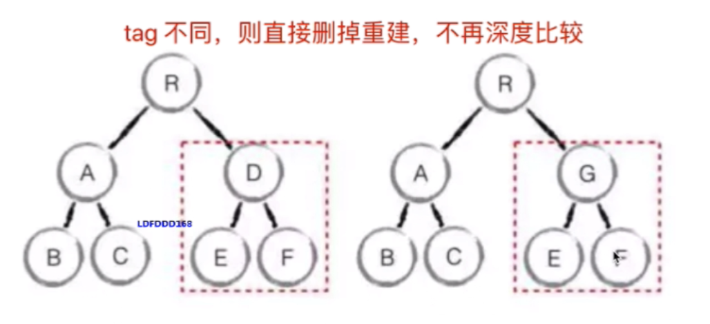

# 虚拟DOM和diff算法

Virtual DOM 其实就是一棵**以 JavaScript 对象（VNode 节点）作为基础的树，用对象属性来描述节点**，实际上它只是一层对真实 DOM 的抽象。最终可以通过一系列操作使这棵树映射到真实环境上。**是为了基于数据驱动视图的这种方式来控制DOM操作的一个性能和效果才用的** 。由于 Virtual DOM 是以 JavaScript 对象为基础而不依赖真实平台环境，所以使它具有了跨平台的能力，比如说浏览器平台、Weex、Node 等。

:::tip
Virtual DOM 是 Vue、React实现的基石。
:::

## 用JS模拟DOM结构

```js
<div id="div1" class="container">
    <p>vdom</p>
    <ul style="font-size:12px">
        <li>a</li>
    </ul>
</div>

----

{
    tag: 'div',
    props: {
        className: 'container',
        id: 'div1'
    },
    children: [
        {
            tag: 'p',
            children: 'vdom'
        },
        {
            tag: 'ul',
            props: {
                style: 'font-size:12px'
            },
            children: [
                {
                    tag: 'li',
                    children: 'a'
                }
            ]
        }
    ]
}

```

## VDom核心

VDom 的核心概念包括：h，vnode，patch（patchVnode）,diff（updateChildren），key等。

diff其实就是比对，它并不是vue或者react独有的，比如linux diff命令，git diff等

两个对象也可以做 diff 比较，如[案例](https://github.com/cujojs/jiff)

两个树也可以做diff，比如 vnode diff


如上图，作比对时，第一次遍历tree1，第二遍遍历tree2，第三次进行排序，因此树的diff时间复杂度为O(n^3)，当节点过多时，显然此种方式不可用。

因此一些工程师为了解决上述问题，将时间复杂度降低到 O(n)，他们做了如下处理：

1. 只比较同一级，不跨级比较

2. tag不相同，则删掉重新创建，不做深入比较

3. tag和key两者都相同，则认为是相同节点，不再深度比较

### snabbdom

通过 [snabbdom](https://github.com/snabbdom/snabbdom/blob/master/README-zh_CN.md) 源码解读去了解学习 diff 算法相关的知识点。

```js
import {
  init,
  classModule,
  propsModule,
  styleModule,
  eventListenersModule,
  h,
} from "snabbdom";

const patch = init([
  // 通过传入模块初始化 patch 函数
  classModule, // 开启 classes 功能
  propsModule, // 支持传入 props
  styleModule, // 支持内联样式同时支持动画
  eventListenersModule, // 添加事件监听
]);

const container = document.getElementById("container");

const vnode = h("div#container.two.classes", { on: { click: someFn } }, [
  h("span", { style: { fontWeight: "bold" } }, "This is bold"),
  " and this is just normal text",
  h("a", { props: { href: "/foo" } }, "I'll take you places!"),
]);
// 传入一个空的元素节点 - 将产生副作用（修改该节点）
patch(container, vnode);

const newVnode = h(
  "div#container.two.classes",
  { on: { click: anotherEventHandler } },
  [
    h(
      "span",
      { style: { fontWeight: "normal", fontStyle: "italic" } },
      "This is now italic type"
    ),
    " and this is still just normal text",
    h("a", { props: { href: "/bar" } }, "I'll take you places!"),
  ]
);
// 再次调用 `patch`
patch(vnode, newVnode); // 将旧节点更新为新节点
```

上述代码通过引入 **snabbdom** 库，通过 init 初始化 patch 函数，然后根据  h 函数生成对应的 vnode 节点进行比较，第一次 传入一个空的元素节点和生成的 vnode 进行 patch 比对，第二次则生成 newVnode 跟之前的 vnode 进行 patch 比对。

### h

**h** 函数如下：

```js
export function h(sel: string): VNode;
export function h(sel: string, data: VNodeData | null): VNode;
export function h(sel: string, children: VNodeChildren): VNode;
export function h(
  sel: string,
  data: VNodeData | null,
  children: VNodeChildren
): VNode;
export function h(sel: any, b?: any, c?: any): VNode {
  // 省略参数定义和具体逻辑处理
  ...
  // 此处返回 vnode 函数
  return vnode(sel, data, children, text, undefined);
}
```

### vnode

**vnode** 函数如下：

```js
export function vnode(
  sel: string | undefined,
  data: any | undefined,
  children: Array<VNode | string> | undefined,
  text: string | undefined,
  elm: Element | DocumentFragment | Text | undefined // VNode 对应的dom元素
): VNode {
  const key = data === undefined ? undefined : data.key;
  // 返回一个对象
  return { sel, data, children, text, elm, key };
}
```

因此可知最终的 h 函数返回的是一个 vnode 对象。

### patch

**patch 函数** 中有几个关键的逻辑点和函数：

* cbs.pre：执行 pre hook（即生命周期函数）
* isElement： 判断是不是一个元素节点
* sameVnode：判断是不是相同的 vnode，会通过对 key 值以及节点属性进行判断，相同则进行 patchVnode 处理，否则删掉重新创建vnode

**patch** 函数如下：

```js
function patch(
    oldVnode: VNode | Element | DocumentFragment,
    vnode: VNode
  ): VNode {
    let i: number, elm: Node, parent: Node;
    const insertedVnodeQueue: VNodeQueue = [];
    // 执行 pre hook
    for (i = 0; i < cbs.pre.length; ++i) cbs.pre[i]();

    // 通过  isElement 判断是不是一个元素节点
    if (isElement(api, oldVnode)) {
      // 创建一个空的 vnode，关联到这个 DOM 元素
      oldVnode = emptyNodeAt(oldVnode);
    } else if (isDocumentFragment(api, oldVnode)) {
      oldVnode = emptyDocumentFragmentAt(oldVnode);
    }
    // sameVnode 判断是不是相同的 vnode，代码如下
    if (sameVnode(oldVnode, vnode)) {
      patchVnode(oldVnode, vnode, insertedVnodeQueue);

    //  不是同一个 vnode，则删掉重新创建
    } else {
      elm = oldVnode.elm!;
      parent = api.parentNode(elm) as Node;
      // 重建新的 vnode
      createElm(vnode, insertedVnodeQueue);

      if (parent !== null) {
        api.insertBefore(parent, vnode.elm!, api.nextSibling(elm));
        removeVnodes(parent, [oldVnode], 0, 0);
      }
    }

    for (i = 0; i < insertedVnodeQueue.length; ++i) {
      insertedVnodeQueue[i].data!.hook!.insert!(insertedVnodeQueue[i]);
    }
    for (i = 0; i < cbs.post.length; ++i) cbs.post[i]();
    return vnode;
  };
```

**sameVnode** 函数如下：

```js
function sameVnode(vnode1: VNode, vnode2: VNode): boolean {
  // 具有相同的 key 以及相关的节点属性
  const isSameKey = vnode1.key === vnode2.key;
  const isSameIs = vnode1.data?.is === vnode2.data?.is;
  const isSameSel = vnode1.sel === vnode2.sel;
  const isSameTextOrFragment =
    !vnode1.sel && vnode1.sel === vnode2.sel
      ? typeof vnode1.text === typeof vnode2.text
      : true;

  return isSameSel && isSameKey && isSameIs && isSameTextOrFragment;
}
```

## diff 算法

### patchVnode

**patchVnode** 函数中关键的逻辑点和函数：

* hook?.prepatch：执行 prepatch hook，相当于生命周期钩子挂载
* elm：设置 vnode.elm，保持新旧 vnode 的 elm 能做对应统一，在替换时新的 vnode 知道要更替哪块的节点
* 执行 hook 相关
* isUndef：一般情况下 vnode 的 text 和 children 是不会共存的，因此通过 isUndef 函数判断分别处理 vnode 的 text 和 children
  * vnode.text === undefined：说明 vnode.children 一般有值
    * 新旧都有 children，updateChildren：对比两个 children
    * 新的有 children，旧的 children 无（旧的 text 有值），旧的 text 有值清空并且添加 vnode children
    * 旧的有 children，新的 children 无，直接移除旧的 children
    * 旧的 text 有值，但上面判断新的 vnode.text === undefined，因此清空 text
  * vnode.text !== undefined ：vnode.children 一般无值
    * 移除旧的 children，设置新的 text

**patchVnode** 函数如下：

```js
function patchVnode(
    oldVnode: VNode,
    vnode: VNode,
    insertedVnodeQueue: VNodeQueue
) {
    // 执行 prepatch hook，相当于生命周期钩子挂载
    const hook = vnode.data?.hook;
    hook?.prepatch?.(oldVnode, vnode);
    // 设置 vnode.elm，保持新旧 vnode 的 elm 能做对应统一，在替换时新的 vnode 知道要更替哪块的节点
    const elm = (vnode.elm = oldVnode.elm)!;
    if (oldVnode === vnode) return;
    // hook 相关
    if (
      vnode.data !== undefined ||
      (isDef(vnode.text) && vnode.text !== oldVnode.text)
    ) {
      vnode.data ??= {};
      oldVnode.data ??= {};
      for (let i = 0; i < cbs.update.length; ++i)
        cbs.update[i](oldVnode, vnode);
      vnode.data?.hook?.update?.(oldVnode, vnode);
    }
    // vnode 的 children
    const oldCh = oldVnode.children as VNode[];
    const ch = vnode.children as VNode[];
    // vnode.text === undefined (vnode.children 一般有值)
    if (isUndef(vnode.text)) {
      // 新旧都有 children
      if (isDef(oldCh) && isDef(ch)) {
        if (oldCh !== ch) updateChildren(elm, oldCh, ch, insertedVnodeQueue);
      // 新的有 children，旧的 children 无（旧的 text 有值）
      } else if (isDef(ch)) {
        // 旧的 text 有值清空并且添加 vnode children
        if (isDef(oldVnode.text)) api.setTextContent(elm, "");
        addVnodes(elm, null, ch, 0, ch.length - 1, insertedVnodeQueue);
      // 旧的有 children，新的 children 无
      } else if (isDef(oldCh)) {
        // 直接移除旧的 children
        removeVnodes(elm, oldCh, 0, oldCh.length - 1);
      // 旧的 text 有值，但上面判断新的 vnode.text === undefined，因此清空
      } else if (isDef(oldVnode.text)) {
        api.setTextContent(elm, "");
      }
    // else: vnode.text !== undefined (vnode.children 一般无值)
    } else if (oldVnode.text !== vnode.text) {
      // 移除旧的 children
      if (isDef(oldCh)) {
        removeVnodes(elm, oldCh, 0, oldCh.length - 1);
      }
      // 设置新的 text
      api.setTextContent(elm, vnode.text!);
    }
    hook?.postpatch?.(oldVnode, vnode);
}
```

### updateChildren

**updateChildren**是在 patchVnode 的过程中，新旧两个 vnode 都存在 children 的情况下，进行的比对函数。

updateChildren 图示：


**updateChildren** 函数中关键的逻辑点和函数：

* 根据传入参数定义新旧 children 的开始下标和节点，结束下标和节点
* 循环处理新旧 children，结束标志是 idx 一边比较一边累加或者累减
  * null 值处理
  * 开始和开始做对比，满足 sameVnode 函数做 patchVnode 处理，新旧 children 的 idx 做累加处理
  * 结束和结束做对比，满足 sameVnode 函数做 patchVnode 处理，新旧 children 的 idx 做累减处理
  * 开始和结束做对比，满足 sameVnode 函数做 patchVnode 处理，旧 children 的 idx 做累加处理，新 children 的 idx 做累减处理
  * 结束和开始做对比，满足 sameVnode 函数做 patchVnode 处理，旧 children 的 idx 做累减处理，新 children 的 idx 做累加处理
  * 上述四个条件都不满足
    * 拿新节点的 key，能否对应 oldCh 中某个节点的 key，没对应上则直接创建新的节点
    * 拿新节点的 key，能否对应 oldCh 中某个节点的 key，对应上 key 的节点则继续判断 sel 是否相等，sel 不相等则直接创建新的节点否则进行 patchVnode 处理

**updateChildren 函数**如下：

```js
  function updateChildren(
    parentElm: Node,
    oldCh: VNode[],
    newCh: VNode[],
    insertedVnodeQueue: VNodeQueue
  ) {
    let oldStartIdx = 0;
    let newStartIdx = 0;
    let oldEndIdx = oldCh.length - 1;
    let oldStartVnode = oldCh[0];
    let oldEndVnode = oldCh[oldEndIdx];
    let newEndIdx = newCh.length - 1;
    let newStartVnode = newCh[0];
    let newEndVnode = newCh[newEndIdx];
    let oldKeyToIdx: KeyToIndexMap | undefined;
    let idxInOld: number;
    let elmToMove: VNode;
    let before: any;

    // 循环处理，结束标志是 idx 一边比较一边累加或者累减
    while (oldStartIdx <= oldEndIdx && newStartIdx <= newEndIdx) {
      // null 值处理
      if (oldStartVnode == null) {
        oldStartVnode = oldCh[++oldStartIdx]; // Vnode might have been moved left
      } else if (oldEndVnode == null) {
        oldEndVnode = oldCh[--oldEndIdx];
      } else if (newStartVnode == null) {
        newStartVnode = newCh[++newStartIdx];
      } else if (newEndVnode == null) {
        newEndVnode = newCh[--newEndIdx];

      // 开始和开始做对比
      } else if (sameVnode(oldStartVnode, newStartVnode)) {
        patchVnode(oldStartVnode, newStartVnode, insertedVnodeQueue);
        oldStartVnode = oldCh[++oldStartIdx];
        newStartVnode = newCh[++newStartIdx];
      // 结束和结束做对比
      } else if (sameVnode(oldEndVnode, newEndVnode)) {
        patchVnode(oldEndVnode, newEndVnode, insertedVnodeQueue);
        oldEndVnode = oldCh[--oldEndIdx];
        newEndVnode = newCh[--newEndIdx];
      // 开始和结束做对比
      } else if (sameVnode(oldStartVnode, newEndVnode)) {
        // Vnode moved right
        patchVnode(oldStartVnode, newEndVnode, insertedVnodeQueue);
        api.insertBefore(
          parentElm,
          oldStartVnode.elm!,
          api.nextSibling(oldEndVnode.elm!)
        );
        oldStartVnode = oldCh[++oldStartIdx];
        newEndVnode = newCh[--newEndIdx];
      // 结束和开始做对比
      } else if (sameVnode(oldEndVnode, newStartVnode)) {
        // Vnode moved left
        patchVnode(oldEndVnode, newStartVnode, insertedVnodeQueue);
        api.insertBefore(parentElm, oldEndVnode.elm!, oldStartVnode.elm!);
        oldEndVnode = oldCh[--oldEndIdx];
        newStartVnode = newCh[++newStartIdx];

      // 以上条件都不满足
      } else {
        if (oldKeyToIdx === undefined) {
          oldKeyToIdx = createKeyToOldIdx(oldCh, oldStartIdx, oldEndIdx);
        }
        // 拿新节点的 key，能否对应 oldCh 中某个节点的 key
        idxInOld = oldKeyToIdx[newStartVnode.key as string];

        // 没对应上
        if (isUndef(idxInOld)) {
          // New element 创建新的节点插入
          api.insertBefore(
            parentElm,
            createElm(newStartVnode, insertedVnodeQueue),
            oldStartVnode.elm!
          );

        // 对应上 key 的节点
        } else {
          elmToMove = oldCh[idxInOld];
          // sel 是否相等 （参考 sameVnode）
          if (elmToMove.sel !== newStartVnode.sel) {
            // New element
            api.insertBefore(
              parentElm,
              createElm(newStartVnode, insertedVnodeQueue),
              oldStartVnode.elm!
            );
          // key 相等，sel 相等
          } else {
            patchVnode(elmToMove, newStartVnode, insertedVnodeQueue);
            oldCh[idxInOld] = undefined as any;
            api.insertBefore(parentElm, elmToMove.elm!, oldStartVnode.elm!);
          }
        }
        // 指针累加
        newStartVnode = newCh[++newStartIdx];
      }
    }

    if (newStartIdx <= newEndIdx) {
      before = newCh[newEndIdx + 1] == null ? null : newCh[newEndIdx + 1].elm;
      addVnodes(
        parentElm,
        before,
        newCh,
        newStartIdx,
        newEndIdx,
        insertedVnodeQueue
      );
    }
    if (oldStartIdx <= oldEndIdx) {
      removeVnodes(parentElm, oldCh, oldStartIdx, oldEndIdx);
    }
  }
```