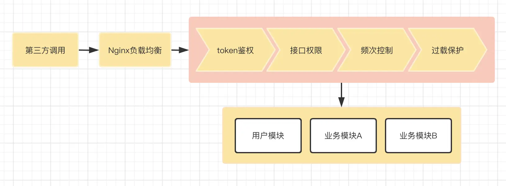

# Node.js高性能如何做到的

Node.js 本身是被设计用来构建快速、可伸缩的网络应用平台，所以NodeJS自诞生起，高性能也是 Node.js 身上的标签。提到 Node 的高性能，就必须说下它的单线程、异步非阻塞I/O、事件驱动。而使得 Node.js 可以通过将操作转移到系统内核中来执行非阻塞I/O操作（尽管javascripts是单线程的）的原理就是事件循环。

## Node.js 事件循环核心流程

Node.js 10+ 版本后在运行结果上与浏览器是一致的，但两者在原理上一个是基于libuv库上，一个是基于浏览器。浏览器的核心是宏任务和微任务，而 Node.js 除了宏任务和微任务还有阶段性任务执行阶段。

:::tip
事件循环通俗来说就是一个无限的 while 循环
:::

> 假设对这个 while 循环不了解，是否会产生以下疑问？

* 谁来启动这个循环过程，循环条件是什么？

* 循环的是什么任务呢？

* 循环的任务是否存在优先级概念？

* 什么进程或者线程来执行这个循环？

* 无限循环有没有终点？

-------

下图为官网提供的事件循环原理的核心流程图。


可以看出，整个流程包含6个阶段，每个阶段所表示的含义也是不同的。

* **timers**：由 setTimeout() 和 setInterval() 这两个函数启动的回调函数
* pending callbacks：执行某些**系统操作**的回调函数，如TCP错误类型
* idle、prepare：仅系统内部使用
* **poll**：主要处理异步 I/O(网络 I/O和文件 I/O)的回调函数，以及其它回调函数
* **check**：执行setImmediate()的回调函数。setImmediate并不是立马执行，而是当事件循环 poll 中没有新的事件处理时才执行该部分，即先执行回调函数，再执行setImmediate
* close callbacks：执行一些关闭的回调函数，如 socket.on('close',...)

在上图中，每一个阶段都会有一个FIFO的可执行回调函数的队列，通常情况下当事件循环进入到其中的一个阶段，就会执行该阶段的操作，再执行该阶段的队列中的回调，一直到队列结束或者达到回调数的限制，之后事件循环就会进入下一个阶段，这样来回循环。

根据这个图，我们可以知道事件循环的顺序大概是：

收到数据(incoming data)->轮询(poll)->检查(check)->关闭回调(close callback)->定时器(timers)->待定回调(pending callbacks)->闲置(idle, prepare)->轮询(poll)

### 运行起点

为了搞清楚是谁来启动这个循环过程，循环条件是什么，首先我们在 node 环境中执行如下代码:

```js
setTimeout(() => {
    console.log('1');
}, 0);
console.log('2')

运行结果：
> 2
> 1
```

可以看到代码先输出2，在输出1，此时结合上图我们会发现疑问，不是说好的 timer 的回调函数是运行起点吗？

首先，当 Node.js 启动后，会先初始化事件循环，处理以提供的输入脚本，它可能会先调用一些异步的 API、调度定时器，或者 process.nextTick()，然后再开始处理事件循环。

总的来说，Node.js 事件循环的发起点有 4 个：

1. Node.js启动后
2. setTimeout 回调函数
3. setInterval 回调函数
4. I/O后的回调函数

### Node.js 事件循环

在事件循环的核心流程中真正需要关注执行循环的是 poll 过程，poll 过程主要是处理异步 I/O （网络 I/O 和文件 I/O）的回调函数及其他几乎所有的回调函数，这也是常见的代码逻辑部分的异步回调逻辑。

下图是事件循环过程中涉及的主要操作过程：


可以看到，事件循环过程除了核心的主线程之外，还包含微任务和宏任务。

主线程执行阶段主要处理**三个阶段**：

* 同步代码
* 将异步任务插入到微任务队列或者宏任务队列中
* 执行微任务或者宏任务的回调函数。
  * 在主线程处理回调函数的同时，同时也会判断是否需要插入微任务或者宏任务
  * 根据优先级，先判断微任务队列是否存在任务，存在则先执行微任务，不存在则判断在宏任务队列是否有任务，有则执行

> 那么在 Node 中微任务和宏任务是怎么解释的？

* 微任务
  * Node 中的微任务有两种 process.nextTick 、Promise
  * 微任务**在事件循环中优先级是最高的**，因此在同一个事件循环中有其他任务存在时，优先执行微任务队列。并且process.nextTick 和 Promise 也存在优先级，process.nextTick 高于 Promise
* 宏任务
  * Node 中宏任务包含 4 种——setTimeout、setInterval、setImmediate 和 I/O
  * 宏任务在微任务执行之后执行，因此在**同一个事件循环周期内**，如果既存在微任务队列又存在宏任务队列，那么**优先将微任务队列清空，再执行宏任务队列**

#### 事件循环实战分析

> 简单的事件循环

```js
const fs = require('fs');
// 首次事件循环执行
console.log('start');
/// 将会在新的事件循环中的阶段执行
/// 文件 I/O 优先级高于 setTimeout，但处理事件长于1ms
fs.readFile('./test.conf', {encoding: 'utf-8'}, (err, data) => {
    if (err) throw err;
    console.log('read file success');
});
/// 主流程执行完成后，超过1ms时，会将setTimeout回调函数逻辑插入到待执行回调函数 poll 队列中
/// setTimeout 如果不设置时间或者设置时间为0，则会默认为1ms
setTimeout(() => { // 新的事件循环的起点
    console.log('setTimeout');
}, 0);
/// 该部分将会在首次事件循环中执行
Promise.resolve().then(()=>{
    console.log('Promise callback');
});
/// 执行 process.nextTick
process.nextTick(() => {
    console.log('nextTick callback');
});
// 首次事件循环执行
console.log('end');
```

根据上述代码可以看到这是一个简单的事件循环，包含微任务（Promise.resolve 和 process.nextTick）和宏任务（fs.readFile 和 setTimeout），分析上述代码执行过程：

1. 第一个事件循环主线程发起，先执行同步代码，输出 `start` ，在输出 `end`
2. 根据优先级先执行微任务，而微任务也存在优先级，因此先执行 process.nextTick 再执行 Promise.resolve，输出 `nextTick callback` ，在输出 `Promise callback`
3. 根据优先级此时执行宏任务，根据宏任务的插入顺序执行 setTimeout 再执行 fs.readFile，**注意**，先执行 setTimeout 由于其回调时间较短，因此回调也先执行，并非是 setTimeout 先执行所以才先执行回调函数，但是 **setTimeout 执行需要时间肯定大于 1ms**，所以虽然 fs.readFile 先于 setTimeout 执行，但是 setTimeout 执行更快，所以先输出 `setTimeout` ，最后输出 `read file success`。

运行结果如下：

```js
> start
> end
> nextTick callback
> Promise callback
> setTimeout
> read file success
```

-------

> 嵌套性事件循环

```js
const fs = require('fs');
setTimeout(() => { // 新的事件循环的起点
    console.log('1');
    fs.readFile('./config/test.conf', {encoding: 'utf-8'}, (err, data) => {
        if (err) throw err;
        console.log('read file sync success');
    });
}, 0);
/// 回调将会在新的事件循环之前
fs.readFile('./config/test.conf', {encoding: 'utf-8'}, (err, data) => {
    if (err) throw err;
    console.log('read file success');
});
/// 该部分将会在首次事件循环中执行
Promise.resolve().then(()=>{
    console.log('poll callback');
});
// 首次事件循环执行
console.log('2');
```

根据上述代码可以看到这是一个嵌套的事件循环，循环微任务和个宏任务时又产生新的微任务和宏任务时，分析上述代码执行过程：

1. 第一个事件循环主线程发起，先执行同步代码，输出 `2`
2. 接着执行微任务，输出 `poll callback`
3. 继续执行宏任务，由于 fs.readFile 优先级高，先执行 fs.readFile，但由于其处理时间大于1ms，因此会先执行 setTimeout，输出 `1`，然后输出 `read file success`。 执行宏任务 setTimeout 过程中产生新的宏任务 fs.readFile，压入后续的宏任务队列
4. 此时任务队列只剩下在过程中产生的宏任务 fs.readFile，处理该任务等待其回调执行完成输出 `read file sync success`

运行结果如下：

```js
> 2
> poll callback
> 1
> read file success
> read file sync success
```

-------

> 阻塞性事件循环

```js
const fs = require('fs');
setTimeout(() => { // 新的事件循环的起点
    console.log('1');
    sleep(10000)
    console.log('sleep 10s');
}, 0);
/// 将会在 poll 阶段执行
fs.readFile('./test.conf', {encoding: 'utf-8'}, (err, data) => {
    if (err) throw err;
    console.log('read file success');
});
console.log('2');
/// 函数实现，参数 n 单位 毫秒 ；
function sleep ( n ) {
    var start = new Date().getTime() ;
    while ( true ) {
        if ( new Date().getTime() - start > n ) {
            // 使用  break  实现；
            break;
        }
    }
}
```

根据上述代码可以看到这是事件循环过程中遇到了阻塞性任务，分析上述代码执行过程：

1. 第一个事件循环主线程发起，先执行同步代码，输出 `2`
2. 继续执行宏任务 setTimeout 和 fs.readFile，原因同上，因为 fs.readFile执行时间大于1ms，先执行 setTimeout，输出 `1`，此时继续执行 setTimeout 的回调函数 sleep，由于在函数内部循环过程中需要 10s 时间，导致无法无法处理 fs.readFile 的回调，只能等待 sleep 执行结束后，输出 `sleep 10s`，此时 setTimeout 回调执行结束并且通知回调到了主线程，输出 `read file success`

运行结果如下：

```js
> 2
> 1
> sleep 10s
> read file success
```

由上面可以得知，**主线程会因为回调函数的执行而被阻塞**，如果不想主线程被阻塞，优先执行 fs.readFile 的回调函数，可以将 setTimeout 的执行时间修改成5ms，如下：

```js
setTimeout(() => { // 新的事件循环的起点
    console.log('1');
    sleep(10000)
    console.log('sleep 10s');
}, 10);

```

运行结果如下：

```js
> 2
> read file success
> 1
> sleep 10s
```

当所有的微任务和宏任务都清空的时候，虽然当前没有任务可执行了，但是也并不能代表循环结束了。因为可能存在当前还未回调的异步 I/O，所以这个循环是没有终点的，只要进程在，并且有新的任务存在，就会去执行。

Node.js 的事件循环是靠一个单线程不断地查询队列中是否有事件，见单写原则，当它读取到一个事件时，将调用与这个事件关联的 javascript 函数，如果这个函数是执行一个 I/O 操作，比如侦听一下8888端口是否有 Scoket 链接，Node.js 会启动这个 I/O 操作，但是不会等待 I/O 操作结束，而是继续到队列中查看是否有下一个事件，如果有，就处理这个事件。

## Node.js 的事件驱动

**Node.js 不善于处理 CPU 密集型的业务**，会导致性能问题，如果要实现一个耗时 CPU 的计算逻辑，处理方法有 2 种：

* 直接在主业务流程中处理；
* 通过网络异步 I/O 给其他进程处理。

同步和异步的处理有何区别？性能耗时上二者又会有什么差异？

#### 主业务流程中处理


可以看到得到结果如下：

```js
499999999075959400curl http://127.0.0.1:4000  0.00s user 0.00s system 0% cpu 1.232 total
```

#### 异步网络 I/O 中处理


可以看到得到结果如下：

```js
499999999075959400curl http://127.0.0.1:4000  0.00s user 0.00s system 0% cpu 0.793 total
```

### 响应分析

通过比对可以发现，在运行结果一致的情况下，异步处理的耗时明显缩减，这样会提升执行效率。异步网络 I/O 充分利用了 Node.js 的异步事件驱动能力，将耗时CPU计算逻辑分配给其它进程处理，因此主线程可直接处理其它请求逻辑，而在主流程执行耗时CPU计算，导致其无法处理其他逻辑，进而影响性能，因此上面服务的执行时间相差甚远。

### 单线程/多线程

遍历 Node.js 事件循环当前事件是在主线程，而主线程是单线程执行的，而异步I/O事件、setTimeout以及垃圾回收、内存优化等则是多线程执行。

### 应用场景

基于 Node.js 事件循环的原理，在使用 Node.js 时应减少或者避免在 Node.js 主线程中被阻塞以及进行一些大内存(V8 内存上限三1.4G)和CPU密集的场景，比如图片处理、大字符串、大数组类处理、大文件读写处理等等。

Node.js的优势在于其异步事件驱动能力较强，能够处理更高的并发，因此我们可以寻找网络I/O处理多、CPU计算少，业务复杂度高的服务。


上图是一个后台服务分类图，虽然不会涵盖所有的服务，但基本都多少包含这些内容，大型系统可能会比这个复杂，小型系统可能并没有这么多的模块。

* 网关，处理请求转发和一些通用的逻辑，例如我们常见的 Nginx
* 业务网关，处理业务相关的逻辑，比如一些通用的协议转化、通用的鉴权处理，以及其他统一的业务安全处理等
* 运营系统，负责我们日常的运营活动或者运营系统
* 业务系统，负责我们核心的业务功能的系统
* 中台服务，负责一些通用 App 类的服务，比如配置下发、消息系统及用户反馈系统等
* 各类基础层，这些就是比较单一的核心后台服务，例如用户模块，这就需要根据不同业务设计不同的核心底层服务
* 左侧的数据缓存和数据存储，则是相应的数据类的服务

#### 业务网关



在上面开放API的应用场景中，粉色框内的功能都是基于缓存来处理业务逻辑，大部分是网络I/O，并未涉及CPU密集逻辑。因此这类轻CPU运算服务在技术选型上可考虑Node.js作为服务端语言

#### 运营系统

运营系统往往逻辑复杂，需根据业务场景进行多次迭代、优化，并发高，但可不涉及底层数据库的读写，更多的是缓存数据的处理，如投票活动

#### 中台服务

中台的概念是将应用中一些通用的业务服务进行集中，其着重关注：网络I/O(高低都可)、并发(高低都可)、通用性(必须好)以及业务复杂度，一般情况下不涉及复杂的CPU运算(低运算)，比如常见的中台业务系统

| 系统 | 通用性 | CPU计算 | 网络I/O | 并发 |
| ---- | -----| -----| -----| -----|
| 前端配置系统 | 是 | 否 | 低 | 高 |
| 反馈系统 | 是 | 否 | 高 | 低 |
| 推送系统 | 是 | 否 | 低 | 低 |
| 系统工具 | 是 | 否 | 低 | 低 |

这样的系统在Node.js主线程中，可快速处理各类业务场景，不会存在阻塞的情况