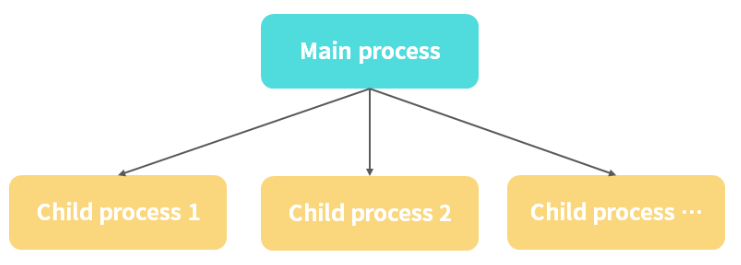

# 如何处理多进程

通过之前对 Node 高性能的分析，可以得知 Node.js 主线程是一个单线程，使用 node app.js 方式运行，就启动了一个进程，**只能在一个 CPU 中进行运算**，无法应用服务器的多核 CPU，因此需要寻求一些解决方案。比如能想到的解决方案肯定是**多进程分发策略**，即主进程接收所有请求，然后通过一定的**负载均衡策略**分发到不同的 Node.js 子进程中。

如图所示，

上述的方案有两个不同的实现：

* 主进程监听一个端口，子进程不监听端口，通过主进程分发请求到子进程
* 主进程和子进程分别监听不同端口，通过主进程分发请求到子进程

### cluster 模式

在 Node.js 中的 **cluster** 模式使用的是第一个实现。通过一个主进程和多个子进程，从而形成一个集群的概念。

先用 cluster 模式对一个简单的 Node.js 服务进行包装，代码如下：

```js
const cluster = require('cluster');
const instances = 2; // 启动进程数量
// 判断是否为主进程
if (cluster.isMaster) {
    // 如果是则使用 cluster.fork 创建子进程
    for(let i = 0;i < instances; i++) {
        cluster.fork();
    }
} else {
    // 一个简单的 Node.js server服务
    // 如果不是则为子进程 require 具体的 app.js
    require('./index.js');
}
```

然后启动如下命令：

```ssh
node cluster.js
```

上述命令启动成功后，在新命令行窗口多次运行如下命令：

```ssh
curl "http://127.0.0.1:3000/"
```

我们得到如下的输出结果：

```ssh
hello world, start with cluster 76941
hello world, start with cluster 76940
hello world, start with cluster 76941
hello world, start with cluster 76940
```

后面的进程 ID 是比较有规律的随机数，有时候输出 76941，有时候输出 76940，76941 和 76940 就是 fork 出来的两个子进程。

#### 原理

#### 一、多进程端口问题

> Node.js 的 cluster 是如何做到多个进程监听一个端口的

#### 二、负载均衡原理

> Node.js 是如何进行负载均衡请求分发的

Node.js cluster 模块使用的是主子进程方式，而对于负载均衡的处理，则是通过 Node.js cluster 模块中的两个模块

* [round_robin_handle.js](https://github.com/nodejs/node/blob/7397c7e4a303b1ebad84892872717c0092852921/lib/internal/cluster/round_robin_handle.js)（非 Windows 平台应用模式）：这是一个**轮询处理模式**，也就是轮询调度分发给空闲的子进程，处理完成后回到 worker 空闲池子中，这里要注意的就是如果绑定过就会复用该子进程，如果没有则会重新判断，这里可以通过上面的 app.js 代码来测试，用浏览器去访问，你会发现每次调用的子进程 ID 都会不变。

* [shared_handle.js](https://github.com/nodejs/node/blob/7397c7e4a303b1ebad84892872717c0092852921/lib/internal/cluster/shared_handle.js)（ Windows 平台应用模式）：通过将文件描述符、端口等信息传递给子进程，子进程通过信息创建相应的 SocketHandle / ServerHandle，然后进行相应的端口绑定和监听、处理请求。

### PM2

PM2 是 cluster 的成熟的应用工具，是守护进程管理器，可以帮助你管理和保持应用程序在线。PM2 入门非常简单，它是一个简单直观的 CLI 工具，可以通过 NPM 安装。