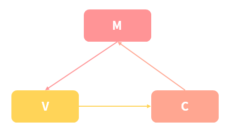
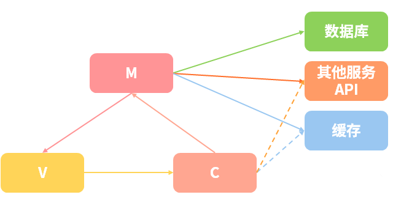
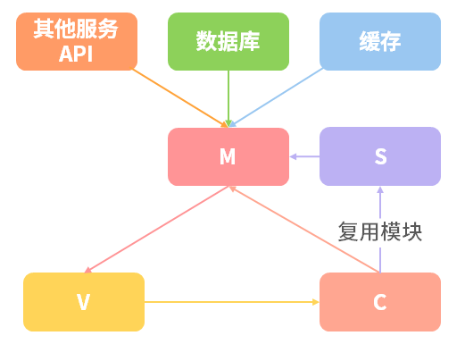
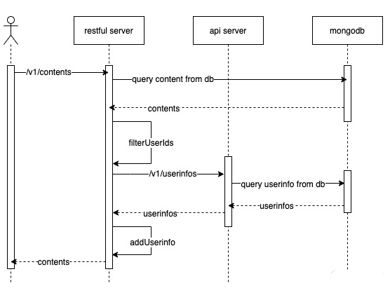
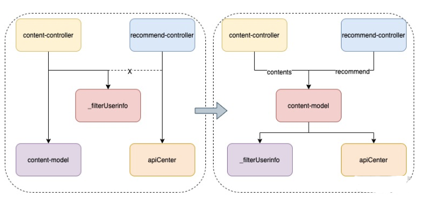

# 如何快速构建 RESTful 服务

:::tip
[RESTful](https://github.com/aisuhua/restful-api-design-references)（Representational State Transfer）是一种架构的约束条件和规则。在倡导前后端分离后，该架构规范的应用愈加广泛。
:::

### MVC 与 MSVC

传统的 MVC 架构的模式如下图，它在前后端分离中起到了非常重要的作用。



* M（Model）层处理数据库相关的操作（只有数据库操作时）

* C（Controller）层处理业务逻辑

* V（View）层则是页面显示和交互

在服务划分较细的情况下，M 层不仅是数据库操作，有时也会有部分开发数据和业务逻辑也在 M 层，有时却在 C 层，原因是 C 与 C 之间无法进行复用，如果需要复用则需要放到 M 层，那么业务逻辑就会冗余在 M，代码会显得非常繁杂。如下图：



为了解决上述问题，有人提出了 MSVC（Model、Service、View、Controller）架构模型，如下图：



MSVC 将所有数据相关的操作都集中于 M 层，而 M 层复用的业务逻辑则转到新的 S 层，C 层则负责核心业务处理，可以调用 M 和 S 层。

接下来通过实现一个简单的 RESTful 服务来了解下两个架构模型的不同点。

### 案例实践

> 实现一个获取用户发帖的列表信息 API

首先设计 RESTful API，一个接口用来拉去列表内容，根据 RESTful 约束规则设计为：GET /v1/contents；另一个用来获取用户信息，，根据 RESTful 约束规则设计为：GET /v1/userinfos



* 先调用 /v1/contents API 拉取 restful server 的内容

* restful server 会首先去 MongoDB 中获取 contents

* 拿到 contents 后解析过滤出其中的 userIds

* 然后再通过 /v1/userinfos API 调用 API server 的服务获取用户信息列表

* API server 同样需要和 MongoDB 交互查询到所需要的 userinfos

* 拿到 userinfos 后通过 addUserinfo 将用户信息整合到 contents 中去

* 最后将 contents 返回给到调用方

#### API server

```js
const http = require('http')
const URL = require('url').URL
const querystring = require('querystring');
const { setResInfo, queryData } = require('../common/util')

/**
 *
 * 创建 http 服务，简单返回
 */

const server = http.createServer(async (req, res) => {
    // 解析请求路径和解析请求参数
    const myUrl = new URL(req.url, `http://${req.headers.host}`);
    const pathname = myUrl.pathname;
    const user_ids = myUrl.searchParams.get('user_ids')

    // 过滤非拉取用户信息请求
    if ('/v1/userinfos' !== pathname) {
        return setResInfo(res, false, 'path not found', null, 404)
    }

    // 参数校验，没有包含参数时返回错误
    if (!user_ids) {
        return setResInfo(res, false, 'path not error')
    }
    // 从 db 查询数据，并获取，有可能返回空数据
    const userInfo = await queryData({ 'id': { $in: user_ids.split(',') } }, 'user')
    return setResInfo(res, true, 'success', userInfo)
})

server.listen(5000, () => {
    console.log('server start http://127.0.0.1:5000')
})
```

* 创建 http 服务，解析请求路径和解析请求参数

* 从 db 根据传入的 ids 查询数据，并获取，有可能返回空数据

* setResInfo 使用 res 对象来设置返回的数据

* queryData 创建数据库连接通过 mongo 来查询 nodejs_cloumn 库中的 user 表，并带上[查询条件](https://mongodb.github.io/node-mongodb-native/2.0/api/index.html)

#### restful server

```js
const http = require('http');
const URL = require('url').URL;
const { setResInfo, queryData, filterUserinfo } = require('../common/util')

/**
 *
 * 创建 http 服务，简单返回
 */
const server = http.createServer(async (req, res) => {
    // 获取 get 参数
    const myUrl = new URL(req.url, `http://${req.headers.host}`);
    const pathname = myUrl.pathname;
    // 过滤非拉取用户信息请求
    if ('/v1/contents' != pathname) {
        return setResInfo(res, false, 'path not found', null, 404);
    }

    // 从 db 查询数据，并获取，有可能返回空数据
    let contents = await queryData({}, 'content', { limit: 10 });

    contents = await filterUserinfo(contents);

    return setResInfo(res, true, 'success', contents);
});

/**
 *
 * 启动服务
 */
server.listen(4000, () => {
    console.log('server start http://127.0.0.1:4000');
});

```

* 创建 http 服务，解析请求路径和解析请求参数

* 从 db 拉取 10 条 content 数据，有可能返回空数据

* setResInfo 使用 res 对象来设置返回的数据

* queryData 创建数据库连接通过 mongo 来查询 nodejs_cloumn 库中的 user 表，并带上[查询条件](https://mongodb.github.io/node-mongodb-native/2.0/api/index.html)
* filterUserinfo 的作用是将 contents 中的 user_id 转化为 userinfo，通过 addUserinfo 合并到 contents 返回

分别启动 API server 和 restful server 两个程序，然后再浏览器运行 API server 请求：

```sh
http://127.0.0.1:5000/v1/userinfos?user_ids=1001,1002
```

得到返回结果

```js
{
    "ret": 0,
    "message": "success",
    "data": [
        {
            "_id": "5fe7ebf1d0a94b97431b6049",
            "id": "1001",
            "name": "test001",
            "desc": "desc001"
        },
        {
            "_id": "5fe7ec16d0a94b97431b604a",
            "name": "test002",
            "desc": "desc002",
            "id": "1002"
        }
    ]
}
```

再运行 restful server 请求：

```sh
http://127.0.0.1:4000/v1/contents
```

得到返回结果

```js
{
    "ret": 0,
    "message": "success",
    "data": [
        {
            "_id": "5fe7eb32d0a94b97431b6043",
            "content": "test content",
            "desc": "test desc",
            "user_id": "1001",
            "user_info": {
                "_id": "5fe7ebf1d0a94b97431b6049",
                "id": "1001",
                "name": "test001",
                "desc": "desc001"
            }
        },
        {
            "_id": "5fe7ebc4d0a94b97431b6048",
            "content": "view content",
            "desc": "view desc",
            "user_id": "1002",
            "user_info": {
                "_id": "5fe7ec16d0a94b97431b604a",
                "name": "test002",
                "desc": "desc002",
                "id": "1002"
            }
        }
    ]
}
```

这就实现了一个简单的  restful 服务的功能，但是目前的代码没有规划，如果场景复杂，根本无法进行有效的团队合作和维护，因此就需要MVC 和 MVCS 架构模式来优化。

#### MVC 实现


通过对之前逻辑的分析，先确定哪属于 M 层逻辑，哪些属于 C 层逻辑，分别创建  model 和 Controller 目录，在其中处理所属的逻辑代码，而且原本的 index.js 没有架构时，处理了一些无关逻辑，如题所示，index 只适合处理 url 路径解析、路由判断及转发。

```sh
├─index.js
├─util
|  └baseFun.js
├─model
|   └content.js
├─core
|  ├─apI-center.js
|  ├─controller.js
|  ├─db.js
|  └model.js
├─controller
|     └content.js
```

* index 处理 url 路径解析、路由判断及转发
* controller
  * content.js 处理 content 的 Controller 逻辑，创建基类来处理 Controller 层相似的逻辑，然后其他 Controller 来继承这个基类
* model
  * content.js 处理 content 的 model 逻辑，创建基类来处理 Model 层相似的逻辑，然后其他 Model 来继承这个基类
* core 核心方法
  * apI-center 调用外部 api
  * controller C 层的基础数据响应方法，把一些相同的功能放入这个基类，比如 res 和 req 的赋值，以及通用返回处理，还有 url 参数解析等
  * model M 层基础数据连接查询，这部分代码与上面简单 restful 服务的类似
  * db 封装 mongodb api
* util 公共方法

#### index.js

```js
const http = require('http');
const URL = require('url').URL;

const baseFun = require('./util/baseFun');

const routerMapping = {
    '/v1/contents' : {
        'controller' : 'content',
        'method' : 'list'
    }
};
/**
 *
 * 创建 http 服务，简单返回
 */
const server = http.createServer(async (req, res) => {
    // 获取 get 参数
    const myUrl = new URL(req.url, `http://${req.headers.host}`);
    const pathname = myUrl.pathname;

    // 过滤非拉取用户信息请求
    if(!routerMapping[pathname]) {
      return baseFun.setResInfo(res, false, 'path not found', null, 404);
    }
    // require 对应的 controller 类
    const ControllerClass = require(`./controller/${routerMapping[pathname]['controller']}`);

    try { // 尝试调用类中的方法
        const controllerObj = new ControllerClass(res, req);
        if(controllerObj[
            routerMapping[pathname]['method']
        ][
            Symbol.toStringTag
        ] === 'AsyncFunction') { // 判断是否为异步 promise 方法，如果是则使用 await
            return await controllerObj[routerMapping[pathname]['method']]();
        } else { // 普通方法则直接调用
            return controllerObj[routerMapping[pathname]['method']]();
        }
    } catch (error) { // 异常时，需要返回 500 错误码给前端
        console.log(error);
        return baseFun.setResInfo(res, false, 'server error', null, 500);
    }
});

/**
 *
 * 启动服务
 */
server.listen(3000, () => {
    console.log('server start http://127.0.0.1:3000');
});
```

#### Controller

```js
class Controller {
    constructor (res, req) {
        this.res = res;
        this.req = req;
    }

    resApi(ret, message, dataInfo, httpStatus = 200) {
        return baseFun.setResInfo(this.res, ret, message, dataInfo, httpStatus);
    }
}

----------

class Content extends Controller {
    constructor (res, req) {
        super(res, req);
    }

    async list() {
        let contentList = await new ContentModel().getList();

        contentList = await this._filterUserinfo(contentList);

        return this.resApi(true, 'success', contentList);
    }

    /**
     * @description 在 contents 中增加用户信息
     * @param array contents
     */
    async _filterUserinfo(contents) {
        ...

        let userinfos = await ApiCenter.callApi('http://127.0.0.1:5000/v1/userinfos', { user_ids: userIds.join(',') });

        ...
    }


    /**
     *
     * @desc 在 content 中增加 userinfo
     * @param {*} contents
     * @param {*} userinfo
     */
    _addUserinfo(contents, mapUserinfo = {}) {
        ...
    }

}

```

#### Model

```js
class Model {
    constructor () {
        this.db = 'nodejs_cloumn';
        this.baseMongo = baseMongo;
    }

    async get(collectionName) {
        const client = await this.baseMongo.getClient();
        const collection = client.db(this.db).collection(collectionName);
        return collection;
    }
}

----------

class ContenModel extends Model {
    constructor () {
        super();
        this.collectionName = 'content';
    }

    async getList() {
        const queryOption = {};
        const collection = await this.get(this.collectionName);
        const queryArr = await collection.find(queryOption).toArray();

        return queryArr;
    }
}
```

通过 M 和 C 基类的定义，让其他的 M 或者 C 继承各自的基类，通过对代码部分逻辑的简介封装，将原有的复杂、不可扩展的代码优化成具有可扩展、易维护的代码。

#### MSVC 实现

```sh
├─index.js
├─util
|  └baseFun.js
├─service
|   └content.js
├─model
|   └content.js
├─core
|  ├─apI-center.js
|  ├─controller.js
|  ├─db.js
|  └model.js
├─controller
|     └content.js
```

通过文件结构的比对，msvc 模型增加了一个 service 层，目的就是为了解决部分业务代码在 M 和 C 层不明确的问题。

**例如：**

上述 MVC 模型中，我们处理用户信息及信息合并时，是通过 _filterUserinfo 是放在 Controller 来处理，但是_filterUserinfo 又牵扯调用 API server 的逻辑，看起来也是数据处理部分，从原理上说这部分不适合放在 Controller。其次当其他 C 层也需要 _filterUserinfo 时，无法调用到这个私有方法，只能为了复用，将其封装到 content-model 中，并且将数据也集中在 Model 层去。



虽然复用代码将其封装解决了目前的各个 C 都能调用的场景，但又会引出新的问题。

问题1：Model 层不干净了，它现在既要负责数据处理，又要负责业务逻辑

问题2：Controller 层的业务减少了，但是分层不明确了，有些业务放在 Model，有些又在 Controller 层，对于后期代码的维护或者扩展都非常困难了

为了解决以上的问题，推出了 Service 层这个概念，如图：浅红色框内，就是新架构模式的 M 层；两个绿色框内为 C 层；最上面的浅蓝色框则为 Service 层。


通过对 Service 层的处理，现在可以解决  M 与 C 层不明确的问题，修改后的 Controller 代码如下

```js
class Content extends Controller {
    constructor (res, req) {
        super(res, req);
    }
    // contentService 就是 Service 层为了解决 _filterUserinfo 逻辑复用的函数
    async list() {
        let contentList = await new ContentModel().getList();

        contentList = await contentService.filterUserinfo(contentList);

        return this.resApi(true, 'success', contentList);
    }
}
```
